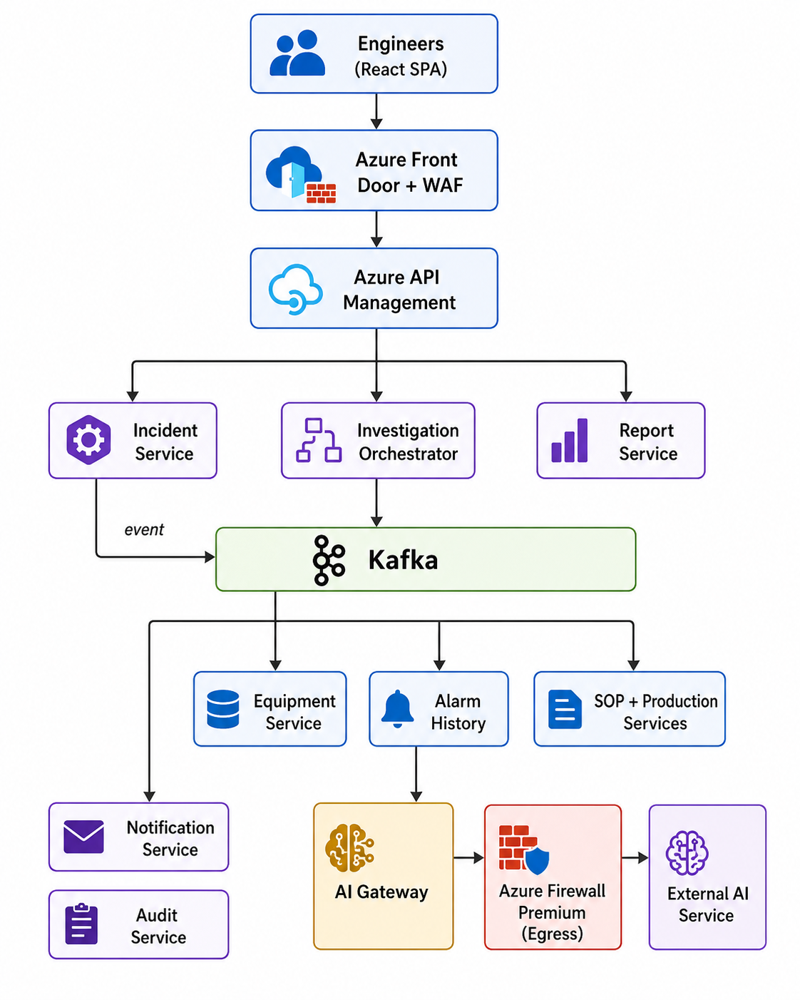
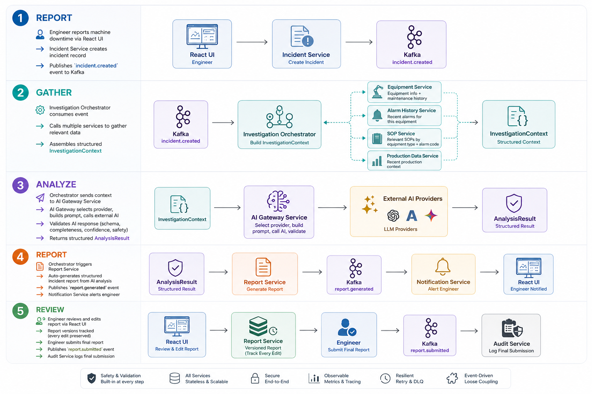

# Architecture Overview

## Executive Summary

The **Incident Investigation Platform** is a microservices-based system designed to automate semiconductor equipment downtime investigations. It replaces a manual, time-consuming process where engineers individually query multiple systems to gather the information needed for root cause analysis.

### Core Value Proposition

| Before (Manual) | After (Platform) |
|-----------------|-----------------|
| Engineer manually queries 5+ systems | Platform automatically gathers all context |
| 30-60 minutes to assemble investigation data | Seconds to minutes (automated pipeline) |
| Inconsistent investigation quality | Standardized, AI-assisted analysis |
| No audit trail of investigation process | Full audit trail of every step |
| Knowledge trapped in individual engineers | Institutional knowledge captured in reports |

---

## Architectural Approach

### Style: Event-Driven Microservices with Orchestrated Saga

The platform uses an **event-driven microservice architecture** where:
- **11 services** are decomposed along **domain-driven bounded contexts**
- **Apache Kafka** provides an event backbone for asynchronous, loosely-coupled communication
- An **Investigation Orchestrator** coordinates the multi-step investigation workflow using the **Saga pattern**
- An **AI Gateway Service** abstracts external AI vendor interactions behind a clean interface

### Why This Approach?

1. **Microservices** — Each data domain (equipment, alarms, SOPs, production) evolves independently with its own team, database, and release cycle.
2. **Event-Driven** — State changes propagate naturally via events, enabling loose coupling. Kafka's durable log enables event replay for future AI training.
3. **Orchestrated Saga** — The investigation workflow has strict ordering (gather → AI → report). A central orchestrator provides observable workflow state, centralized error handling, and easy extensibility for new steps.
4. **AI Abstraction** — The external AI service is wrapped behind a Strategy + Adapter pattern. Providers can be swapped via configuration. Responses are validated through a multi-layer pipeline.

---

## High-Level System View

---

## Investigation Workflow Summary

---

## Key Architectural Decisions

| Decision | Choice | Rationale | See |
|----------|--------|-----------|-----|
| Service decomposition | Domain-driven (11 services) | Business capability alignment | [ADR-004](docs/11-architecture-decision-records/ADR-004-database-per-service.md) |
| Communication backbone | Apache Kafka | Durable events, replay for AI, loose coupling | [ADR-001](docs/11-architecture-decision-records/ADR-001-event-driven-architecture.md) |
| Investigation coordination | Orchestrated Saga | Strict ordering, central error handling | [ADR-002](docs/11-architecture-decision-records/ADR-002-orchestration-vs-choreography.md) |
| AI integration | Strategy + Adapter pattern | Vendor independence, fallback, validation | [ADR-003](docs/11-architecture-decision-records/ADR-003-ai-abstraction-layer.md) |
| Technology stack | .NET 10, PostgreSQL, AKS | Enterprise-grade, Azure-native, type-safe | [ADR-005](docs/11-architecture-decision-records/ADR-005-technology-stack-selection.md) |
| Service mesh | Not adopted (Polly + K8s native) | Overkill for 11 services, .NET has built-in resilience | [ADR-006](docs/11-architecture-decision-records/ADR-006-no-service-mesh.md) |
| Container Platform | AKS (over Container Apps) | Portability, GitOps FluxCD, CNI zero-trust policies | [ADR-007](docs/11-architecture-decision-records/ADR-007-aks-vs-container-apps.md) |

---

## Non-Functional Highlights

| Aspect | Approach |
|--------|----------|
| **Security** | Azure Front Door WAF edge, Azure AD, RBAC, TLS 1.3 edge termination, Key Vault Workload Identity, Azure Firewall Premium egress, PII redaction |
| **Observability** | OTel + Prometheus + Grafana + Loki (app metrics/logs/traces) and Azure Monitor (platform/infrastructure logs) |
| **Resilience** | Polly (circuit breaker, retry, timeout, bulkhead); Kafka DLQ; AI provider fallback |
| **Scalability** | HPA per service, Kafka partitioning, Redis caching, PG read replicas |
| **High Availability** | Multi-AZ AKS, zone-redundant databases, 3+ replicas per service |
| **Disaster Recovery** | Azure paired region, geo-replication, RPO < 5min, RTO < 1hr |
| **Audit** | Append-only audit log capturing all state changes, AI interactions, user actions |

---

## Estimated Monthly Cost (Azure)

| Environment | Monthly Cost (USD) |
|------------|-------------------|
| Production (HA, multi-AZ) | $2,400 — $4,200 |
| Staging | $800 — $1,200 |
| Development (local Docker) | $0 — $50 |

See [Deployment Architecture](docs/07-deployment-architecture/README.md) for detailed cost breakdown.

---

## Document Index

For the complete architecture documentation, see the [README](README.md) navigation table.
