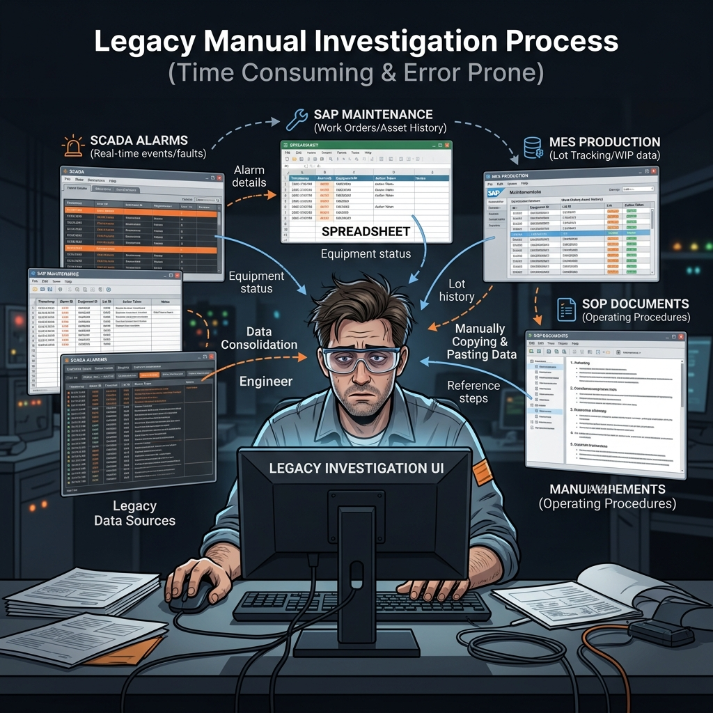
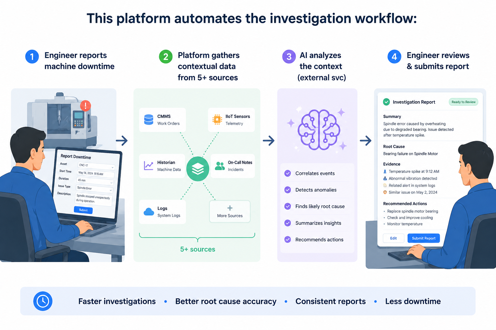
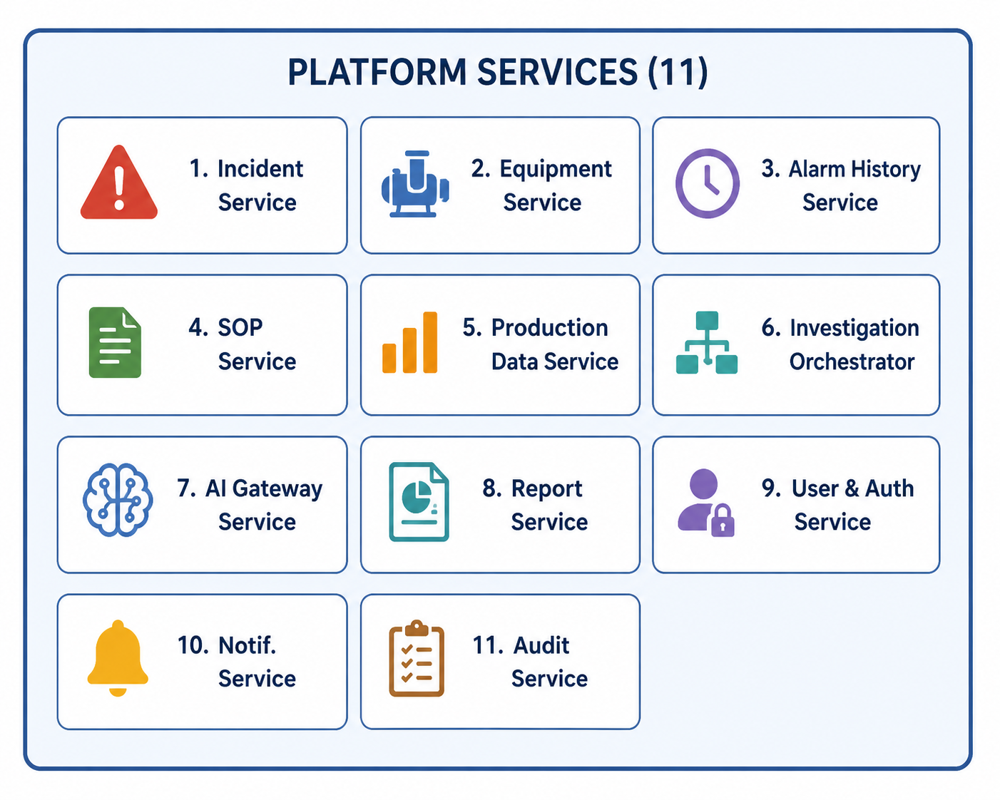

# AI-Ready Manufacturing Incident Investigation Platform

## Architecture Documentation

A comprehensive architecture design for an enterprise-grade, AI-ready platform that assists semiconductor equipment engineers during machine downtime investigations. The platform consolidates data from multiple sources, leverages external AI services for analysis, and produces structured incident reports.

---

## Problem Statement

Semiconductor equipment engineers currently **manually** retrieve alarm logs, maintenance history, SOPs, and production information when machine downtime occurs — before deciding on corrective actions. This is time-consuming, error-prone, and doesn't scale.

### The "Before" State: Manual Data Gathering

### The "After" State: Automated Platform Solution

The architecture is designed to support **future Agentic AI capabilities** without requiring re-architecture.

---

## Quick Navigation

| # | Document | Description |
|---|----------|-------------|
| 1 | [System & Software Architecture](docs/01-system-and-software-architecture/README.md) | C4 diagrams (System Context, Container, Component), technology stack with trade-off analysis |
| 2 | [Microservice Design](docs/02-microservice-design/README.md) | Service decomposition, responsibilities, communication patterns, domain events |
| 3 | [API Design](docs/03-api-design/README.md) | REST API principles, endpoint catalog, OpenAPI 3.0 specifications |
| 4 | [Data Flow](docs/04-data-flow/README.md) | End-to-end data flow, data ownership map, event flow |
| 5 | [Integration Strategy](docs/05-integration-strategy/README.md) | External system integration patterns, adapters, failure handling |
| 6 | [Database Design](docs/06-database-design/README.md) | Entity relationship diagram, SQL schemas, design decisions |
| 7 | [Deployment Architecture](docs/07-deployment-architecture/README.md) | Kubernetes topology, CI/CD, HA/DR, cost estimation |
| 8 | [AI Integration Strategy](docs/08-ai-integration-strategy/README.md) | AI abstraction layer, context preparation, vendor independence, agentic AI readiness |
| 9 | [Non-Functional Architecture](docs/09-non-functional-architecture/README.md) | Security, observability, resilience, scalability, audit trail |
| 10 | [Sequence Diagrams](docs/10-sequence-diagrams/README.md) | End-to-end workflows, error handling flows, state machines |
| 11 | [Architecture Decision Records](docs/11-architecture-decision-records/) | Formal justification for every major architectural decision |

**Supporting Materials:**
| Resource | Description |
|----------|-------------|
| [Architecture Overview](ARCHITECTURE.md) | Executive summary of the entire architecture |
| [Code Snippets](snippets/) | Illustrative C# interfaces, DTOs, and patterns (not runnable implementations) |

---

## Technology Stack

| Layer | Technology | Purpose |
|-------|-----------|---------|
| **Backend Services** | .NET 10 / C# | Microservice implementation |
| **Frontend** | React + TypeScript | Engineer investigation dashboard |
| **API Gateway** | Azure API Management | Routing, rate limiting, authentication |
| **Message Broker** | Apache Kafka (Azure Event Hubs) | Async event-driven communication |
| **Primary Database** | PostgreSQL (Azure Flexible Server) | Transactional data per service |
| **Time-Series Store** | TimescaleDB | Alarm history (high-volume time-series) |
| **Search Engine** | Elasticsearch | Full-text SOP search, future RAG |
| **Cache** | Redis (Azure Cache) | Equipment data caching, session, idempotency |
| **Object Storage** | Azure Blob Storage | SOP documents, report PDFs |
| **Authentication** | Azure AD + OAuth 2.0 / OIDC | Enterprise SSO, JWT tokens |
| **Container Platform** | AKS (Azure Kubernetes Service) | Orchestration, auto-scaling |
| **CI/CD** | GitHub Actions | Build, test, scan, deploy |
| **Observability** | OpenTelemetry + Prometheus + Grafana + Loki | Metrics, logs, traces |
| **Resilience** | Polly (.NET) | Circuit breaker, retry, timeout |

---

## Architecture Principles

| # | Principle | Description |
|---|-----------|-------------|
| 1 | **Domain-Driven Decomposition** | Services map to business capabilities, not technical layers |
| 2 | **API-First Design** | All contracts defined before implementation |
| 3 | **Event-Driven Backbone** | Kafka events for loose coupling and extensibility |
| 4 | **AI as a Pluggable Capability** | AI behind an abstraction layer; vendor-swappable |
| 5 | **Database-per-Service** | Each service owns its data; no shared databases |
| 6 | **Orchestrated Saga** | Investigation workflow managed by a central orchestrator |
| 7 | **Zero-Trust Security** | Authentication and encryption at every boundary |
| 8 | **Observability by Design** | Structured logging, tracing, and metrics built-in |

---

## Microservice Overview

---

## Author

**Rehan** — Solution Architect

---

## License

This document is proprietary and confidential. Created as part of a technical architecture assessment.
