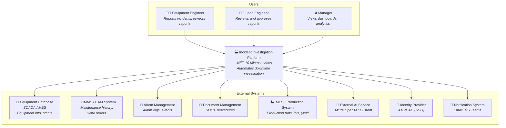
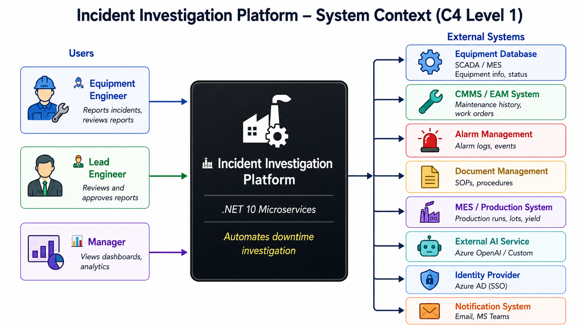
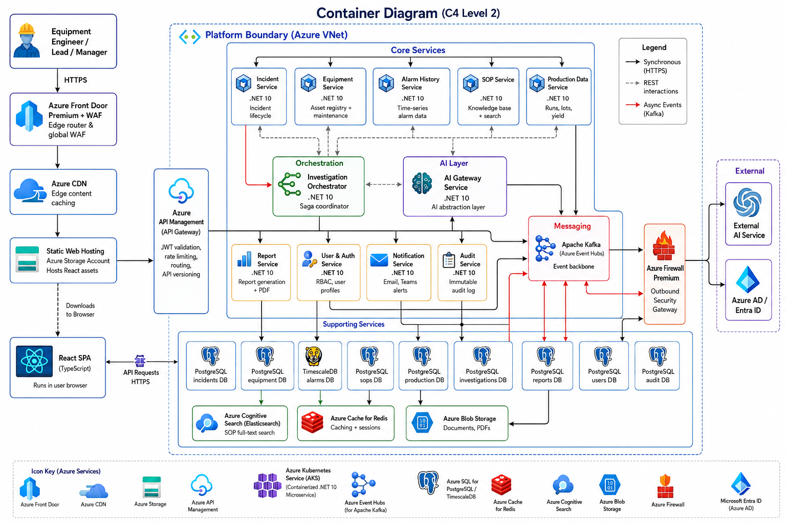
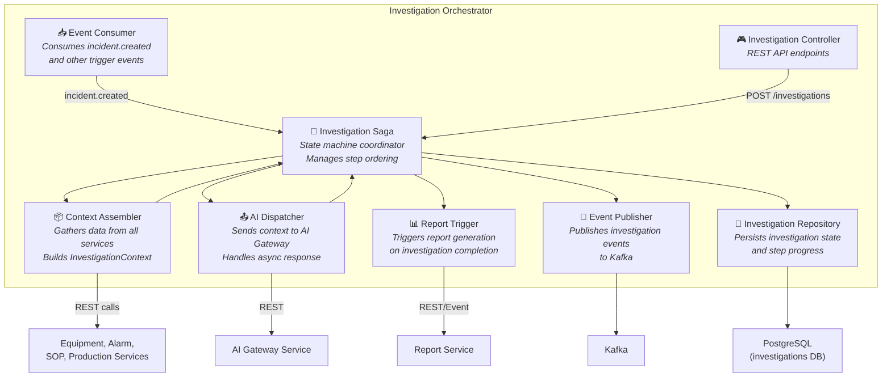
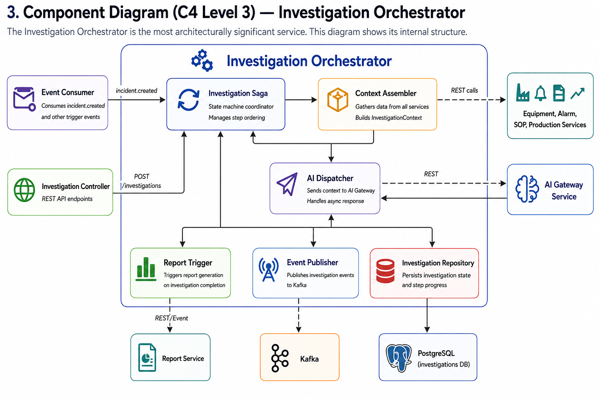
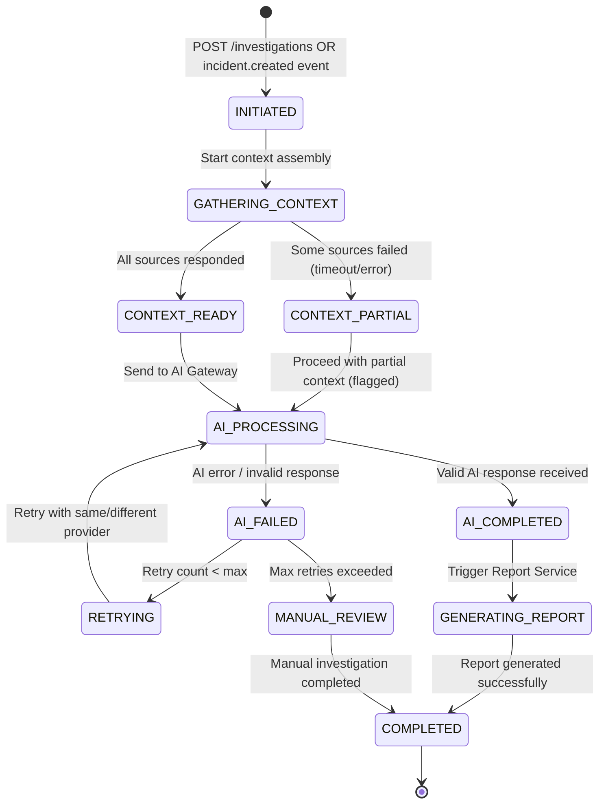
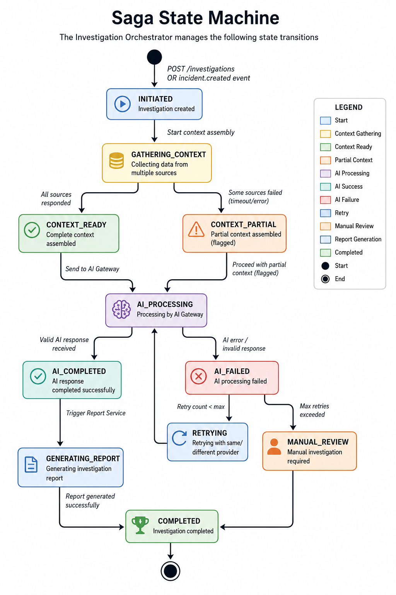
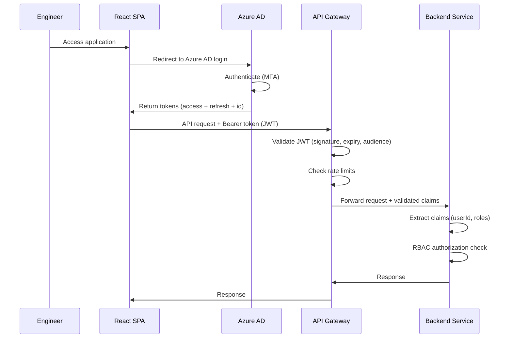
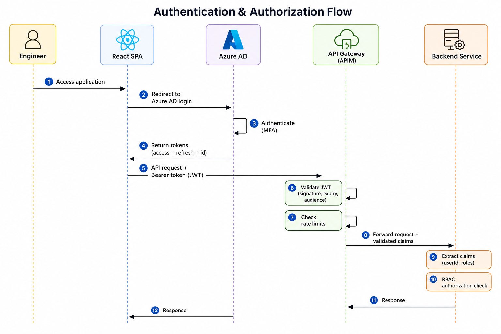

# 01 — System & Software Architecture

## Overview

This document presents the architecture of the Incident Investigation Platform at three levels of abstraction, following the [C4 Model](https://c4model.com/):
- **Level 1 — System Context**: The platform in its ecosystem
- **Level 2 — Container**: Services, databases, and infrastructure inside the platform
- **Level 3 — Component**: Internal structure of key services

It also provides a complete technology stack with trade-off analysis for every major choice.

---

## 1. System Context Diagram (C4 Level 1)

The platform as a black box, showing all external actors and systems it interacts with.

> [!TIP]
> **Visual Reference**: If the diagram above does not render in your markdown viewer, you can view the exported image file directly:
> 

### External System Descriptions

| System | Data Provided | Integration Pattern | Protocol |
|--------|--------------|-------------------|----------|
| **Equipment Database (SCADA/MES)** | Equipment registry, configuration, operational status, location | REST adapter with Redis caching | REST API / OPC-UA |
| **CMMS / EAM System** | Maintenance history, work orders, parts replaced, downtime records | REST/SOAP adapter wrapping legacy API | REST / SOAP |
| **Alarm Management System** | Real-time alarm events, alarm codes, severity, timestamps | Event ingestion via Kafka + REST query | Kafka / REST |
| **Document Management** | SOPs, troubleshooting procedures, maintenance guides | Periodic sync + Elasticsearch indexing | REST API |
| **MES / Production System** | Production runs, lot/wafer information, recipe parameters, yield data | REST adapter with caching | REST API |
| **External AI Service** | AI-powered incident analysis, root cause suggestions, corrective actions | AI Gateway abstraction (Strategy pattern) | REST API (HTTPS) |
| **Identity Provider (Azure AD)** | User authentication, SSO, group memberships | OAuth 2.0 / OIDC standard protocol | OIDC |
| **Notification System** | Delivery channel for alerts and status updates | Outbound adapter (fire-and-forget) | SMTP / Webhook |

---

## 2. Container Diagram (C4 Level 2)

Zoom into the platform boundary. Shows all services (containers), their databases, and communication paths.

```mermaid
graph TB
    %% ── External Users ──
    USER["🧑‍🔧 Equipment Engineer / Lead / Manager"]

    %% ── Global Edge & Delivery ──
    FD["🚪 Azure Front Door Premium + WAF<br/>Edge router & global WAF"]
    CDN["🌐 Azure CDN<br/>Edge content caching"]
    STATIC_WEB["📦 Static Web Hosting<br/>Azure Storage Account<br/>Hosts React assets"]

    USER -->|HTTPS| FD
    FD --> CDN
    CDN --> STATIC_WEB

    subgraph platform_vnet ["Platform Boundary (Azure VNet)"]
        SPA["🖥️ React SPA<br/><i>TypeScript</i><br/><i>Runs in user browser</i>"]

        APIM["🚪 Azure API Management<br/><i>API Gateway</i><br/><i>JWT validation, rate limiting,<br/>routing, API versioning</i>"]

        subgraph Core Services
            INC["📋 Incident Service<br/><i>.NET 10</i><br/><i>Incident lifecycle</i>"]
            EQUIP["🔧 Equipment Service<br/><i>.NET 10</i><br/><i>Asset registry + maintenance</i>"]
            ALARM["🚨 Alarm History Service<br/><i>.NET 10</i><br/><i>Time-series alarm data</i>"]
            SOP["📄 SOP Service<br/><i>.NET 10</i><br/><i>Knowledge base + search</i>"]
            PROD["🏭 Production Data Service<br/><i>.NET 10</i><br/><i>Runs, lots, yield</i>"]
        end

        subgraph Orchestration
            ORCH["🎯 Investigation Orchestrator<br/><i>.NET 10</i><br/><i>Saga coordinator</i>"]
        end

        subgraph AI Layer
            AIGW["🤖 AI Gateway Service<br/><i>.NET 10</i><br/><i>AI abstraction layer</i>"]
        end

        subgraph Supporting Services
            RPT["📊 Report Service<br/><i>.NET 10</i><br/><i>Report generation + PDF</i>"]
            AUTH["🔐 User & Auth Service<br/><i>.NET 10</i><br/><i>RBAC, user profiles</i>"]
            NOTIF_SVC["📧 Notification Service<br/><i>.NET 10</i><br/><i>Email, Teams alerts</i>"]
            AUDIT["📝 Audit Service<br/><i>.NET 10</i><br/><i>Immutable audit log</i>"]
        end

        subgraph Messaging
            KAFKA["📨 Apache Kafka<br/><i>Azure Event Hubs</i><br/><i>Event backbone</i>"]
        end

        subgraph Data Stores
            PG_INC["🗄️ PostgreSQL<br/><i>incidents DB</i>"]
            PG_EQUIP["🗄️ PostgreSQL<br/><i>equipment DB</i>"]
            PG_ALARM["🗄️ TimescaleDB<br/><i>alarms DB</i>"]
            PG_SOP["🗄️ PostgreSQL<br/><i>sops DB</i>"]
            PG_PROD["🗄️ PostgreSQL<br/><i>production DB</i>"]
            PG_INV["🗄️ PostgreSQL<br/><i>investigations DB</i>"]
            PG_RPT["🗄️ PostgreSQL<br/><i>reports DB</i>"]
            PG_AUTH["🗄️ PostgreSQL<br/><i>users DB</i>"]
            PG_AUDIT["🗄️ PostgreSQL<br/><i>audit DB</i>"]
            ES["🔍 Elasticsearch<br/><i>SOP full-text search</i>"]
            REDIS["⚡ Redis<br/><i>Azure Cache</i><br/><i>Caching + sessions</i>"]
            BLOB["📦 Azure Blob Storage<br/><i>Documents, PDFs</i>"]
        end

        FIREWALL["🛡️ Azure Firewall Premium<br/>Outbound Security Gateway"]
    end

    subgraph External
        EXT_AI["🤖 External AI Service"]
        EXT_IDP["🔐 Azure AD / Entra ID"]
    end

    %% ── Inbound Client Routing ──
    STATIC_WEB -->|Downloads to Browser| SPA
    SPA -->|API Requests HTTPS| FD
    FD --> APIM

    %% ── Gateway to Services ──
    APIM --> INC
    APIM --> EQUIP
    APIM --> ALARM
    APIM --> SOP
    APIM --> PROD
    APIM --> ORCH
    APIM --> RPT
    APIM --> AUTH

    %% ── Domain Write Databases ──
    INC --> PG_INC
    EQUIP --> PG_EQUIP
    EQUIP --> REDIS
    ALARM --> PG_ALARM
    SOP --> PG_SOP
    SOP --> ES
    PROD --> PG_PROD
    ORCH --> PG_INV
    RPT --> PG_RPT
    RPT --> BLOB
    AUTH --> PG_AUTH
    AUDIT --> PG_AUDIT

    %% ── Saga REST Interactions ──
    ORCH -.->|REST| EQUIP
    ORCH -.->|REST| ALARM
    ORCH -.->|REST| SOP
    ORCH -.->|REST| PROD
    ORCH -.->|REST| AIGW
    AIGW --> REDIS

    %% ── Async Event Backbone ──
    INC --> KAFKA
    ORCH --> KAFKA
    RPT --> KAFKA
    NOTIF_SVC --> KAFKA
    AUDIT --> KAFKA

    %% ── Outbound to External via Firewall ──
    AIGW --> FIREWALL
    NOTIF_SVC --> FIREWALL
    AUTH --> FIREWALL
    FIREWALL --> EXT_AI
    FIREWALL --> EXT_IDP
```

> [!TIP]
> **Visual Reference**: If the diagram above does not render in your markdown viewer, you can view the exported image file directly:
> 

### Container Descriptions

| Container | Technology | Purpose | Database | Communication |
|-----------|-----------|---------|----------|---------------|
| **Azure Front Door Premium** | Azure Front Door + WAF | Global entry point, SSL termination, path-based routing, Web Application Firewall | — | HTTPS (inbound from Internet), HTTPS (outbound to CDN & APIM) |
| **Azure CDN** | Standard Microsoft CDN | Caches frontend static files at global edge PoPs to reduce latency | — | HTTPS (reads from Static Web Storage) |
| **Static Web Hosting** | Azure Storage Account | Serves static React build (index.html, JS, CSS, assets) securely | — | File download to browser |
| **React SPA** | React + TypeScript | Engineer-facing dashboard for incident reporting, investigation tracking, and report review | — | Downloads via CDN, makes API calls to Front Door |
| **Azure API Management** | Azure APIM (Standard V2) | API Gateway: enforces rate-limiting, JWT signature checks, and route matching | — | HTTPS (inbound), HTTP (to AKS Load Balancer) |
| **Incident Service** | .NET 10 | Create, track, manage incidents; lifecycle state machine (REPORTED → CLOSED) | PostgreSQL | REST (sync) + Kafka (events) |
| **Equipment Service** | .NET 10 | Equipment registry, configuration, status; maintenance history query | PostgreSQL + Redis | REST (sync) |
| **Alarm History Service** | .NET 10 | Ingest and query alarm events; time-series queries by equipment + time range | TimescaleDB | REST (sync) + Kafka (ingestion) |
| **SOP Service** | .NET 10 | Manage SOPs; full-text search by equipment type, alarm code, keywords | PostgreSQL + Elasticsearch | REST (sync) |
| **Production Data Service** | .NET 10 | Production runs, lot/wafer info, recipe parameters, yield data | PostgreSQL | REST (sync) |
| **Investigation Orchestrator** | .NET 10 | Coordinates the investigation saga: gather context → AI → report; state machine | PostgreSQL | Kafka (events) + REST (calls to other services) |
| **AI Gateway Service** | .NET 10 | Abstracts AI vendor interactions; prompt management; response validation; fallback | Redis (cache) | REST (sync, internal only) |
| **Report Service** | .NET 10 | Generate, store, version reports; PDF export; engineer review workflow | PostgreSQL + Blob Storage | REST (sync) + Kafka (events) |
| **User & Auth Service** | .NET 10 | OAuth2/OIDC proxy to Azure AD; RBAC authorization; user profiles | PostgreSQL | REST (sync) |
| **Notification Service** | .NET 10 | Email, MS Teams, in-app notifications for investigation status changes | — (stateless) | Kafka (async, event-driven only) |
| **Audit Service** | .NET 10 | Immutable audit log; consumes all domain events; compliance queries | PostgreSQL (append-only) | Kafka (async, event-driven only) |
| **Apache Kafka** | Azure Event Hubs (Kafka protocol) | Durable event backbone; topics for incidents, investigations, reports, audit | — | Kafka protocol |
| **Redis** | Azure Cache for Redis | Equipment data caching, session management, idempotency keys, prompt cache | — | Redis protocol |
| **Elasticsearch** | Self-hosted or Elastic Cloud | Full-text search on SOPs; future vector search for RAG-based AI | — | REST (HTTP) |
| **Azure Blob Storage** | Azure Blob | SOP documents, investigation artifacts, report PDFs | — | Azure SDK |
| **Azure Firewall Premium** | Azure Firewall | Egress controller: restricts outbound HTTP/HTTPS calls from internal nodes to allowed endpoints | — | Outbound HTTPS to external providers |

---

## 3. Component Diagram (C4 Level 3) — Investigation Orchestrator

The Investigation Orchestrator is the most architecturally significant service. This diagram shows its internal structure.

> [!TIP]
> **Visual Reference**: If the diagram above does not render in your markdown viewer, you can view the exported image file directly:
> 

### Saga State Machine

The Investigation Orchestrator manages the following state transitions:

> [!TIP]
> **Visual Reference**: If the diagram above does not render in your markdown viewer, you can view the exported image file directly:
> 

---

## 4. Technology Stack — Detailed Trade-off Analysis

For every major technology choice, we evaluated alternatives and documented the trade-offs.

### 4.1 Backend Framework: .NET 10 / C#

| Criteria | .NET 10 / C# ✅ | Java / Spring Boot | Node.js / TypeScript |
|----------|-----------------|-------------------|---------------------|
| **Type Safety** | ✅ Strong static typing | ✅ Strong static typing | ⚠️ TypeScript adds it, but runtime is untyped |
| **Performance** | ✅ Excellent (Kestrel, AOT) | ✅ Good (JVM warm-up) | ⚠️ Single-threaded event loop |
| **Azure Integration** | ✅ First-class Azure SDK | ⚠️ Good, but not native | ⚠️ Good, but not native |
| **Enterprise Ecosystem** | ✅ EF Core, Polly, MediatR, MassTransit | ✅ Spring ecosystem | ⚠️ Fragmented ecosystem |
| **Resilience Patterns** | ✅ Polly (native) | ✅ Resilience4j | ⚠️ No dominant library |
| **Manufacturing Industry** | ✅ Common in enterprise/manufacturing | ✅ Common | ⚠️ Less common in manufacturing |

**Decision**: .NET 10 — best combination of type safety, performance, Azure integration, and enterprise ecosystem. Polly provides built-in resilience patterns that eliminate the need for a service mesh.

### 4.2 Primary Database: PostgreSQL

| Criteria | PostgreSQL ✅ | SQL Server | CosmosDB |
|----------|--------------|------------|----------|
| **Cost** | ✅ Open-source, lower Azure cost | ❌ License cost | ⚠️ Expensive at scale (RU-based) |
| **JSONB Support** | ✅ Native, indexed | ⚠️ JSON support, less mature | ✅ Native document store |
| **Array Types** | ✅ Native (for alarm codes in SOPs) | ❌ Not supported | ✅ Native |
| **TimescaleDB Extension** | ✅ Time-series in same ecosystem | ❌ Not available | ❌ Not applicable |
| **Azure Managed** | ✅ Flexible Server (HA, backups) | ✅ Azure SQL (mature) | ✅ Fully managed |
| **Community/Tooling** | ✅ Massive ecosystem | ✅ Mature | ⚠️ Vendor lock-in |

**Decision**: PostgreSQL — open-source cost advantage, JSONB for flexible AI response storage, TimescaleDB extension for alarm time-series, strong Azure managed offering.

### 4.3 Message Broker: Apache Kafka (Azure Event Hubs)

| Criteria | Kafka (Event Hubs) ✅ | RabbitMQ | Azure Service Bus |
|----------|----------------------|----------|-------------------|
| **Durability** | ✅ Persistent log, configurable retention | ⚠️ Message consumed = gone | ✅ Durable |
| **Event Replay** | ✅ Consumer can replay from any offset | ❌ Not supported | ❌ Not supported |
| **Ordering** | ✅ Per-partition ordering | ⚠️ Per-queue only | ✅ Per-session |
| **Throughput** | ✅ Very high (millions/sec) | ⚠️ Lower | ⚠️ Lower |
| **AI Training Future** | ✅ Replay events for AI model training | ❌ Events are lost after consumption | ❌ Events are lost |
| **Azure Managed** | ✅ Event Hubs (Kafka protocol) | ⚠️ Self-managed | ✅ Fully managed |

**Decision**: Kafka via Azure Event Hubs — durable event log enables future AI training on historical events. Event replay is critical for debugging and auditing. Kafka protocol compatibility means no vendor lock-in.

### 4.4 API Gateway: Azure API Management

| Criteria | Azure APIM ✅ | Kong | AWS API Gateway |
|----------|--------------|------|-----------------|
| **Azure Native** | ✅ First-class integration | ⚠️ Self-managed on K8s | ❌ AWS ecosystem |
| **JWT Validation** | ✅ Built-in policy | ✅ Plugin | ✅ Built-in |
| **Rate Limiting** | ✅ Built-in policy | ✅ Plugin | ✅ Built-in |
| **Developer Portal** | ✅ Auto-generated from OpenAPI | ⚠️ Available (Enterprise) | ❌ Not available |
| **Analytics** | ✅ Built-in Azure Monitor | ⚠️ Prometheus plugin | ✅ CloudWatch |
| **Cost** | ⚠️ $50-$700/month depending on tier | ✅ Open-source (self-managed) | ⚠️ Pay-per-request |

**Decision**: Azure APIM — native Azure integration, built-in policies for JWT validation and rate limiting, auto-generated developer portal from OpenAPI specs. The Developer tier ($50/month) is sufficient for non-production; Standard tier for production.

### 4.5 Observability: OpenTelemetry + Prometheus + Grafana + Loki

| Criteria | OTel + Prometheus + Grafana ✅ | Azure Monitor / App Insights | Datadog |
|----------|-------------------------------|------------------------------|---------|
| **Vendor Lock-in** | ✅ Open-source, portable | ⚠️ Azure-specific | ❌ Proprietary |
| **Cost** | ✅ Free (self-hosted) | ⚠️ Cost at scale (log ingestion) | ❌ Expensive ($23+/host/month) |
| **.NET Integration** | ✅ OTel SDK for .NET | ✅ App Insights SDK | ✅ Datadog SDK |
| **Custom Dashboards** | ✅ Grafana (excellent) | ⚠️ Azure Dashboards (limited) | ✅ Excellent |
| **Distributed Tracing** | ✅ OTel → Grafana Tempo | ✅ App Insights | ✅ APM |
| **Log Aggregation** | ✅ Grafana Loki | ✅ Log Analytics | ✅ Log Management |

**Decision**: OpenTelemetry for instrumentation (vendor-neutral), Prometheus for metrics, Grafana for dashboards, Loki for logs, Tempo for traces. Zero vendor lock-in; can switch backends without code changes. Self-hosted on AKS to control costs.

### 4.6 Resilience: Polly (.NET)

| Criteria | Polly (.NET native) ✅ | Istio Service Mesh | Custom Implementation |
|----------|----------------------|--------------------|-----------------------|
| **Sidecar Overhead** | ✅ None (in-process) | ❌ ~50-100MB per pod | ✅ None |
| **Latency Impact** | ✅ Negligible | ⚠️ Adds ~1-3ms per hop | ✅ Negligible |
| **Fine-grained Control** | ✅ Per-endpoint policies | ⚠️ Per-service only | ✅ Full control |
| **Operational Complexity** | ✅ NuGet package | ❌ Control plane + CRDs | ⚠️ Custom code to maintain |
| **Circuit Breaker** | ✅ Built-in | ✅ Envoy | ⚠️ Manual |
| **Retry + Backoff** | ✅ Built-in | ✅ Envoy | ⚠️ Manual |
| **Timeout** | ✅ Built-in | ✅ Envoy | ⚠️ Manual |
| **Bulkhead** | ✅ Built-in | ⚠️ Limited | ⚠️ Manual |

**Decision**: Polly via `Microsoft.Extensions.Http.Resilience` — provides all resilience patterns (circuit breaker, retry, timeout, bulkhead) without sidecar overhead. Fine-grained per-endpoint policies. A service mesh (Istio) can be introduced later at 30+ services if needed, but is overkill for 11 services.

### 4.7 CI/CD: GitHub Actions + FluxCD (GitOps)

| Criteria | GitHub Actions + FluxCD ✅ | Azure DevOps | Jenkins |
|----------|-------------------|-------------|---------|
| **CI Automation** | ✅ Native GHA runners (Docker build, scan) | ✅ Good | ❌ Self-managed agent VMs |
| **GitOps/Sync** | ✅ FluxCD (drives deployment state inside AKS) | ❌ Push-based only | ❌ Push-based only |
| **IaC Integration** | ✅ Terraform/Bicep triggers on PR merge | ✅ Good | ⚠️ Custom integration |
| **Audit & Security** | ✅ Immutable Git history of cluster state | ⚠️ Less auditable | ❌ Hard to audit |
| **Secrets Safety** | ✅ GitOps reads secrets directly from Key Vault | ⚠️ Requires environment mapping | ❌ Secrets stored in Jenkins config |

**Decision**: A hybrid model is adopted:
*   **GitHub Actions** orchestrates the Continuous Integration (CI) stage, compiling .NET code, running unit tests, executing security vulnerability checks (Trivy, Snyk), and building/pushing tagged Docker images to Azure Container Registry (ACR).
*   **FluxCD** acts as the GitOps agent running inside AKS, continuously syncing cluster state with the deployment repository's Helm chart values. This prevents configuration drift and eliminates direct Kubernetes credential exposure in external pipelines.
*   **Terraform / Bicep** is used for Infrastructure as Code (IaC) to provision cloud resources, managed via GitHub Actions pull request checks.

---

## 5. Cross-Cutting Architectural Concerns

### 5.1 Authentication & Authorization Flow

> [!TIP]
> **Visual Reference**: If the diagram above does not render in your markdown viewer, you can view the exported image file directly:
> 

### 5.2 RBAC Role Matrix

| Permission | Engineer | Lead Engineer | Manager | Admin |
|-----------|----------|---------------|---------|-------|
| Create incident | ✅ | ✅ | ✅ | ✅ |
| View own incidents | ✅ | ✅ | ✅ | ✅ |
| View all incidents | ❌ | ✅ | ✅ | ✅ |
| Trigger investigation | ✅ | ✅ | ✅ | ✅ |
| Edit report | ✅ (own) | ✅ (all) | ❌ | ✅ |
| Submit report | ✅ | ✅ | ❌ | ✅ |
| Approve report | ❌ | ✅ | ✅ | ✅ |
| View audit trail | ❌ | ❌ | ✅ | ✅ |
| Manage users | ❌ | ❌ | ❌ | ✅ |
| Configure AI providers | ❌ | ❌ | ❌ | ✅ |
| Manage SOPs | ❌ | ✅ | ❌ | ✅ |

### 5.3 Shared Patterns Across All Services

| Pattern | Implementation | Purpose |
|---------|---------------|---------|
| **Structured Logging** | Serilog + OpenTelemetry | Consistent JSON logs with correlation IDs |
| **Health Checks** | ASP.NET Health Checks middleware | Kubernetes liveness/readiness probes |
| **Configuration** | Azure App Configuration + Key Vault | Centralized config, secrets separated |
| **API Versioning** | Asp.Versioning package | URI-based versioning (`/v1/`, `/v2/`) |
| **Validation** | FluentValidation | Request validation with clear error messages |
| **Mapping** | Mapster | DTO ↔ Domain model mapping |
| **Mediator** | MediatR | CQRS command/query separation within services |
| **Resilience** | Polly | Circuit breaker, retry, timeout per HTTP client |
| **OpenAPI** | Swashbuckle / NSwag | Auto-generated API documentation |

---

## 6. Summary

| Aspect | Decision |
|--------|----------|
| **Architecture Style** | Event-driven microservices with orchestrated saga |
| **Services** | 11 domain-driven services |
| **Backend** | .NET 10 / C# |
| **Frontend** | React + TypeScript |
| **Database Strategy** | Database-per-service (PostgreSQL) |
| **Communication** | REST (sync) + Kafka (async events) |
| **AI Integration** | AI Gateway with Strategy + Adapter pattern |
| **Gateway** | Azure Front Door Premium + WAF + API Management (APIM) |
| **Auth** | Microsoft Entra ID (Azure AD) + OAuth 2.0 / OIDC + RBAC |
| **Resilience** | Polly (.NET) — no service mesh |
| **Observability** | OpenTelemetry + Prometheus + Grafana + Loki |
| **Deployment** | AKS (Azure Kubernetes Service) |
| **CI/CD** | GitHub Actions (CI / IaC) + FluxCD (GitOps) |

---

*Next: [02 — Microservice Design →](../02-microservice-design/README.md)*
