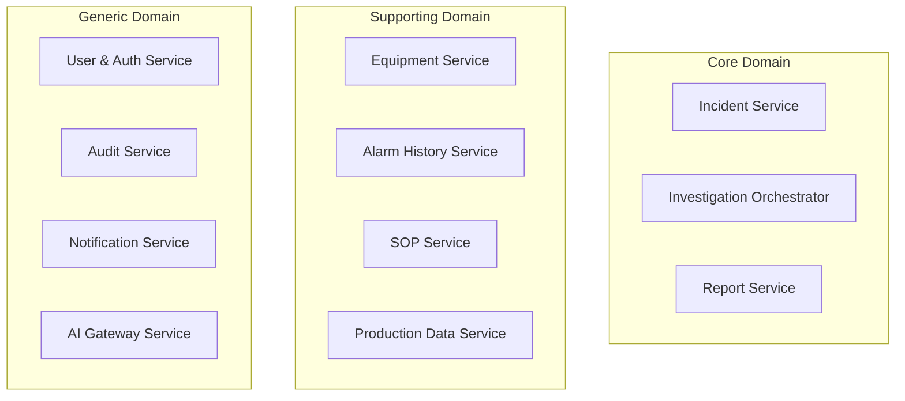
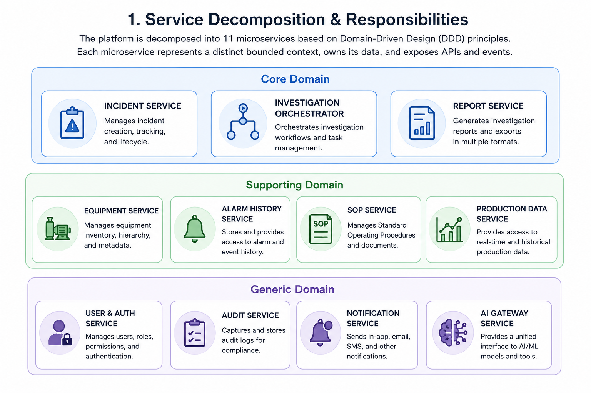
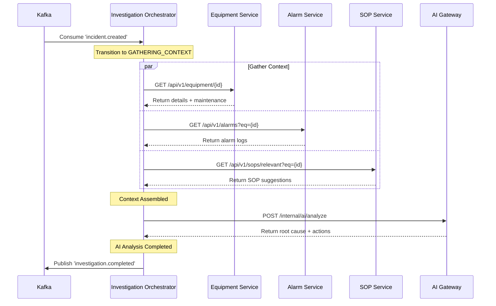
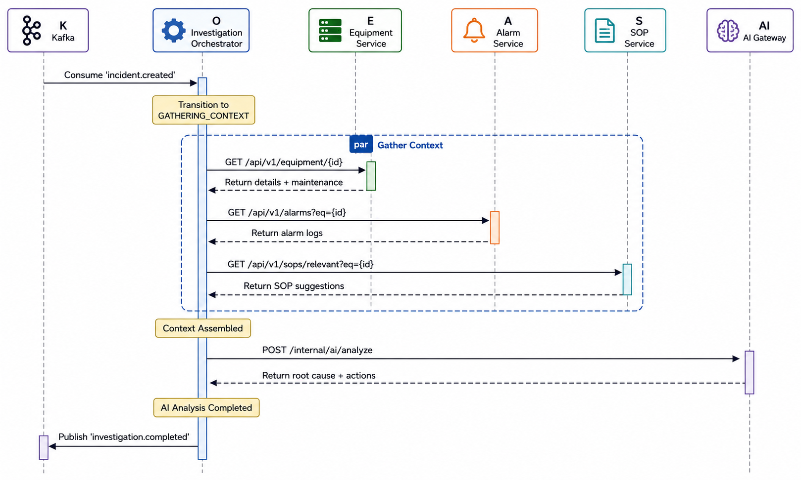
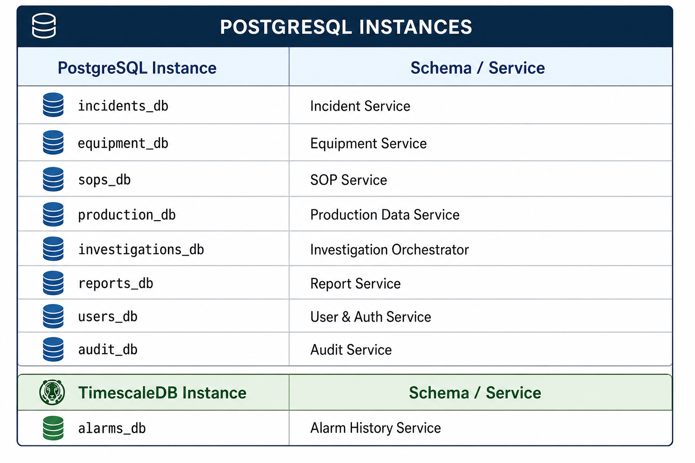

# 02 — Microservice Design

## 1. Service Decomposition & Responsibilities

The platform is decomposed into **11 microservices** based on Domain-Driven Design (DDD) principles. Each microservice represents a distinct bounded context, owns its data, and exposes APIs and events.



> [!TIP]
> **Visual Reference**: If the diagram above does not render in your markdown viewer, you can view the exported image file directly:
> 

---

### Service Registry & Profiles

#### 1. Incident Service
*   **Domain Type**: Core Domain
*   **Responsibility**: Manages the lifecycle of a machine downtime incident. It acts as the system of record for incident reports, transitions their state, and logs the incident timeline.
*   **Database**: PostgreSQL (`incidents_db`)
*   **Key Entities**: `Incident` (Aggregate Root), `IncidentTimelineEntry`
*   **Exposed APIs**: CRUD incidents, transition status, get timeline.
*   **Published Events**: `incident.created`, `incident.updated`, `incident.status.changed`, `incident.closed`
*   **Consumed Events**: `report.submitted` (to close incident)

#### 2. Equipment Service
*   **Domain Type**: Supporting Domain
*   **Responsibility**: The registry for all physical assets (semiconductor manufacturing tools, chambers). Maintains tool configurations and tracks physical status (e.g., Run, Idle, Down, Maintenance).
*   **Database**: PostgreSQL (`equipment_db`) + Redis (cache)
*   **Key Entities**: `Equipment` (Aggregate Root), `Chamber`, `MaintenanceRecord`
*   **Exposed APIs**: Get equipment configuration, get maintenance history.
*   **Published Events**: `equipment.status.changed`, `equipment.maintenance.scheduled`
*   **Consumed Events**: None

#### 3. Alarm History Service
*   **Domain Type**: Supporting Domain
*   **Responsibility**: Ingests high-frequency alarm logs and event streams from factory tools. Optimised for time-series range queries to retrieve active/historical alarms around the downtime window.
*   **Database**: TimescaleDB / PostgreSQL (`alarms_db`)
*   **Key Entities**: `AlarmEvent` (Hypertable)
*   **Exposed APIs**: Query alarms by equipment, time-range, or severity.
*   **Published Events**: `alarm.triggered`, `alarm.resolved`
*   **Consumed Events**: None

#### 4. SOP Service
*   **Domain Type**: Supporting Domain
*   **Responsibility**: Maintains Standard Operating Procedures (SOPs), troubleshooting workflows, and corrective action guides. Provides full-text search capability.
*   **Database**: PostgreSQL (`sops_db`) + Elasticsearch
*   **Key Entities**: `SOP` (Aggregate Root), `SOPSection`, `SOPVersion`
*   **Exposed APIs**: Search SOPs, get SOP document by ID, find relevant SOPs.
*   **Published Events**: `sop.published`, `sop.archived`
*   **Consumed Events**: None

#### 5. Production Data Service
*   **Domain Type**: Supporting Domain
*   **Responsibility**: Tracks manufacturing contexts, such as current production runs, active wafer lots, yield metrics, and recipe details active at the time of a tool failure.
*   **Database**: PostgreSQL (`production_db`)
*   **Key Entities**: `ProductionRun`, `LotInfo`, `RecipeParameter`
*   **Exposed APIs**: Get run details, get recipe parameters, get production context.
*   **Published Events**: `production.run.started`, `production.run.completed`
*   **Consumed Events**: None

#### 6. Investigation Orchestrator
*   **Domain Type**: Core Domain (Saga Coordinator)
*   **Responsibility**: Orchestrates the multi-step automated investigation workflow. Acts as the state-machine controller that coordinates data collection, AI analysis, and report triggering.
*   **Database**: PostgreSQL (`investigations_db`)
*   **Key Entities**: `InvestigationSaga` (Aggregate Root), `SagaStepStatus`
*   **Exposed APIs**: Start investigation, check saga status, retrieve gathered context.
*   **Published Events**: `investigation.started`, `investigation.context.gathered`, `investigation.ai.requested`, `investigation.ai.completed`, `investigation.ai.failed`, `investigation.completed`
*   **Consumed Events**: `incident.created` (starts the saga)

#### 7. AI Gateway Service
*   **Domain Type**: Generic Domain (AI Abstraction)
*   **Responsibility**: Provides a vendor-neutral boundary to external Large Language Models (LLMs) and agentic endpoints. Manages prompt templates, monitors token usage/costs, applies circuit breakers, and runs validation on AI payloads.
*   **Database**: Redis (`prompt_templates`, idempotency, response cache)
*   **Key Entities**: `PromptTemplate`, `CachedAIResult`
*   **Exposed APIs**: Analyse incident context (internal REST endpoint).
*   **Published Events**: `ai.token.consumed`, `ai.request.failed`
*   **Consumed Events**: None

#### 8. Report Service
*   **Domain Type**: Core Domain
*   **Responsibility**: Generates, stores, and versions the structured incident investigation reports. Manages engineer reviews, edits, and final approvals before export/submission.
*   **Database**: PostgreSQL (`reports_db`) + Azure Blob Storage
*   **Key Entities**: `InvestigationReport` (Aggregate Root), `ReportVersion`
*   **Exposed APIs**: CRUD reports, patch/edit report sections, submit, download PDF.
*   **Published Events**: `report.generated`, `report.edited`, `report.submitted`
*   **Consumed Events**: `investigation.completed` (triggers generation)

#### 9. User & Auth Service
*   **Domain Type**: Generic Domain
*   **Responsibility**: Proxy to enterprise Identity Providers (Azure AD). Resolves claims, manages Role-Based Access Control (RBAC) policies, and stores user profiles.
*   **Database**: PostgreSQL (`users_db`)
*   **Key Entities**: `User`, `Role`, `Permission`
*   **Exposed APIs**: Authenticate, validate token, get user authorization scope.
*   **Published Events**: `user.login.audit`
*   **Consumed Events**: None

#### 10. Notification Service
*   **Domain Type**: Generic Domain
*   **Responsibility**: Dispatches notifications (emails, MS Teams adaptive cards, SMS) to engineers and managers based on workflow state.
*   **Database**: None (Stateless)
*   **Key Entities**: None
*   **Exposed APIs**: None (strictly event-driven)
*   **Published Events**: None
*   **Consumed Events**: `report.generated`, `investigation.ai.failed`, `incident.status.changed`

#### 11. Audit Service
*   **Domain Type**: Generic Domain (Compliance)
*   **Responsibility**: Records all write actions, user login events, and AI requests into an immutable audit ledger for compliance and regulatory verification.
*   **Database**: PostgreSQL (`audit_db` - configured as append-only)
*   **Key Entities**: `AuditTrailEntry`
*   **Exposed APIs**: Query audit logs (Admin/Lead only).
*   **Published Events**: None
*   **Consumed Events**: Consumes *all* domain events (`*`) from Kafka.

---

## 2. Service Communication Architecture

Services communicate using two primary architectural patterns to ensure high performance and maximum decoupling:

1.  **Synchronous HTTP/REST**: Used exclusively for read queries where a response is immediately required (Request/Reply), or direct commands that require immediate validation.
2.  **Asynchronous Messaging (Apache Kafka)**: Used for state changes, side-effects, and orchestrating multi-step workflows.

### Orchestration vs. Choreography

We selected the **Orchestrated Saga Pattern** to manage the incident investigation lifecycle rather than Choreographed Events.

#### Rationale for Orchestrated Saga:
*   **Strict Sequencing**: Gaining root cause insights from an AI requires a deterministic order: we *must* have equipment info, alarms, and SOPs collected *before* calling the AI. In a choreographed flow, tracking this ordering is distributed, leading to "spaghetti events."
*   **Centralised Error Handling**: If the AI Gateway fails after 3 retries, the Orchestrator can cleanly transition the saga to `AI_FAILED`, flag the incident, and publish an event to notify engineers. In choreography, compensating transactions are complex to implement.
*   **Observability**: A single database table (`investigation_steps`) stores the current status of each step, making it simple for the React UI to show a progress bar to the engineer.



> [!TIP]
> **Visual Reference**: If the diagram above does not render in your markdown viewer, you can view the exported image file directly:
> 

---

## 3. Communication Contracts & Event Formats

To ensure reliability, all events published to Apache Kafka are strictly typed. Below are the definitions of critical C# event records.

### C# Domain Event Definitions

```csharp
namespace Platform.Shared.Contracts.Events;

/// <summary>
/// Triggered when an engineer registers a downtime incident.
/// </summary>
public record IncidentCreatedEvent(
    Guid IncidentId,
    string AssetTag,
    Guid ReportedBy,
    DateTime DowntimeStart,
    string Description,
    int Severity
) : IDomainEvent;

/// <summary>
/// Triggered when the orchestrator completes context gathering.
/// </summary>
public record InvestigationContextGatheredEvent(
    Guid InvestigationId,
    Guid IncidentId,
    string AssetTag,
    int TotalAlarmsCollected,
    int TotalSopsCollected
) : IDomainEvent;

/// <summary>
/// Triggered when the AI finishes analysis and outputs validated recommendations.
/// </summary>
public record InvestigationAiCompletedEvent(
    Guid InvestigationId,
    Guid IncidentId,
    string ProviderName,
    double ConfidenceScore,
    DateTime ProcessedAt
) : IDomainEvent;

/// <summary>
/// Triggered when the investigation is fully complete and context is ready for reporting.
/// </summary>
public record InvestigationCompletedEvent(
    Guid InvestigationId,
    Guid IncidentId,
    Guid ReportId
) : IDomainEvent;

/// <summary>
/// Triggered when the Report Service finishes auto-generating the structured report.
/// </summary>
public record ReportGeneratedEvent(
    Guid ReportId,
    Guid InvestigationId,
    Guid IncidentId,
    string Title,
    string StorageUrl
) : IDomainEvent;
```

---

## 4. Bounded Context Database Mapping

To enforce strict service boundaries and avoid shared database anti-patterns, the database instances are isolated:

```
┌────────────────────────────────────────────────────────┐
│                   POSTGRESQL INSTANCES                 │
├──────────────────────┬─────────────────────────────────┤
│ PostgreSQL Instance  │ Schema / Service                │
├──────────────────────┼─────────────────────────────────┤
│ incidents_db         │ Incident Service                │
│ equipment_db         │ Equipment Service               │
│ sops_db              │ SOP Service                     │
│ production_db        │ Production Data Service         │
│ investigations_db    │ Investigation Orchestrator      │
│ reports_db           │ Report Service                  │
│ users_db             │ User & Auth Service             │
│ audit_db             │ Audit Service                   │
├──────────────────────┼─────────────────────────────────┤
│ TimescaleDB Instance │ Schema / Service                │
├──────────────────────┼─────────────────────────────────┤
│ alarms_db            │ Alarm History Service           │
└──────────────────────┴─────────────────────────────────┘
```

> [!TIP]
> **Visual Reference**: If the diagram above does not render in your markdown viewer, you can view the exported image file directly:
> 

---

*Next: [03 — API Design →](../03-api-design/README.md)*
