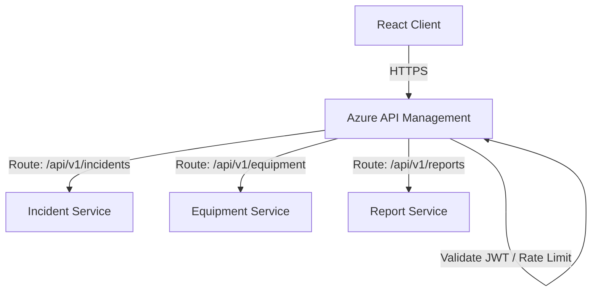
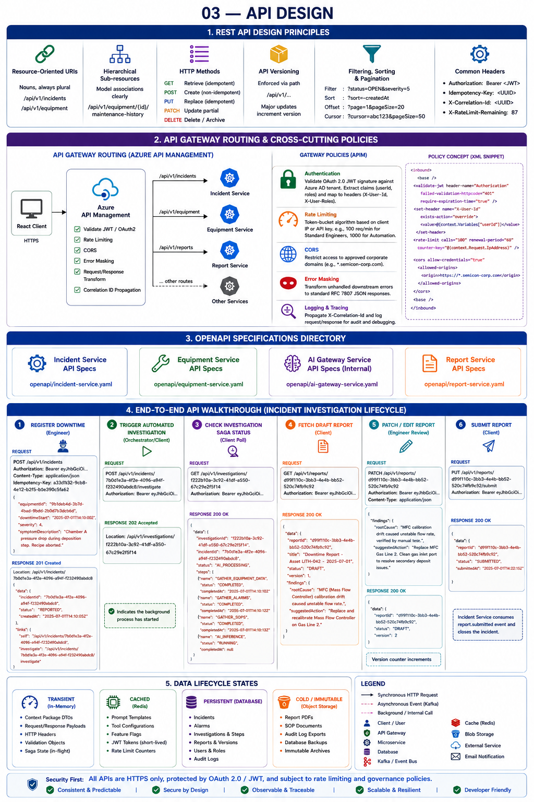

# 03 — API Design

## 1. REST API Design Principles

The platform follows a uniform and developer-friendly RESTful interface design, aligned with industry best practices:

*   **Resource-Oriented URIs**: Nouns, always plural (e.g., `/api/v1/incidents`, `/api/v1/equipment`).
*   **Hierarchical Sub-resources**: Nested sub-resources model associations clearly (e.g., `/api/v1/equipment/{id}/maintenance-history`).
*   **HTTP Methods**:
    *   `GET` for idempotent resource retrieval (queries).
    *   `POST` for non-idempotent resource creation.
    *   `PUT` for full, idempotent replacement of a resource.
    *   `PATCH` for partial, non-idempotent updates (e.g., editing specific report fields).
    *   `DELETE` for resource archival/deletion.
*   **API Versioning**: Enforced via the request path (`/api/v1/...`). Major updates trigger version increments.
*   **Filtering, Sorting & Pagination**:
    *   Filtering is applied via query string: `?status=OPEN&severity=5`.
    *   Sorting is applied via the `sort` parameter: `?sort=-createdAt` (descending) or `?sort=assetTag` (ascending).
    *   Pagination defaults to offset-based (`?page=1&pageSize=20`) for lists, and cursor-based (`?cursor=abc123d&pageSize=50`) for high-volume time-series data like alarms.
*   **Common Headers**:
    *   `Authorization: Bearer <JWT>` for auth validation.
    *   `Idempotency-Key: <UUID>` for safely retrying POST commands.
    *   `X-Correlation-Id: <UUID>` for tracing requests across microservices.
    *   `X-RateLimit-Remaining`: Informs client of rate-limit quota.

---

## 2. API Gateway Routing & Cross-Cutting Policies

The platform deploys **Azure API Management (APIM)** as its frontend API Gateway. APIM manages inbound client requests, runs validation, and forwards traffic to the internal K8s cluster IP services.



> [!TIP]
> **Visual Reference**: If the diagram above does not render in your markdown viewer, you can view the exported image file directly:
> 

### Gateway Policies (XML Snippet Concept)
APIM applies policies to enforce constraints uniformly:
*   **Authentication**: Validate OAuth 2.0 JWT signature against Azure AD tenant. Extract claims (userID, roles) and map them to HTTP headers (`X-User-Id`, `X-User-Roles`) before routing to downstream microservices.
*   **Rate Limiting**: Apply token-bucket algorithm based on client IP or authenticated API key (e.g., max 100 requests per minute for standard engineers, 1000 for automation scripts).
*   **CORS**: Restrict access to approved corporate domains (e.g., `*.semicon-corp.com`).
*   **Error Masking**: Trap unhandled downstream errors and transform them to standard RFC 7807 JSON error responses.

---

## 3. OpenAPI Specifications Directory

To view the machine-readable definitions for our services, visit the schema files:

*   [Incident Service API Specs](openapi/incident-service.yaml)
*   [Equipment Service API Specs](openapi/equipment-service.yaml)
*   [Alarm History Service API Specs](openapi/alarm-history-service.yaml)
*   [SOP Service API Specs](openapi/sop-service.yaml)
*   [Production Data Service API Specs](openapi/production-data-service.yaml)
*   [Investigation Orchestrator API Specs](openapi/investigation-orchestrator.yaml)
*   [AI Gateway Service API Specs (Internal)](openapi/ai-gateway-service.yaml)
*   [Report Service API Specs](openapi/report-service.yaml)
*   [User & Auth Service API Specs](openapi/user-auth-service.yaml)
*   [Audit Service API Specs](openapi/audit-service.yaml)

*(Note: Notification Service is strictly event-driven and does not expose synchronous HTTP APIs.)*

---

## 4. End-to-End API Walkthrough

Here is the exact lifecycle of REST calls during an incident investigation:

### 1. Register Downtime (Engineer)
```http
POST /api/v1/incidents HTTP/1.1
Host: api.semicon-corp.com
Authorization: Bearer eyJhbGciOi...
Content-Type: application/json
Idempotency-Key: a33d1b32-9cb8-4e12-b2f5-b3e390c5fa62

{
  "equipmentId": "9b1deb4d-3b7d-4bad-9bdd-2b0d7b3dcb6d",
  "downtimeStart": "2025-07-01T14:10:00Z",
  "severity": 4,
  "symptomDescription": "Chamber A pressure drop during deposition step. Recipe aborted."
}
```
**Response**: `201 Created`
```http
HTTP/1.1 201 Created
Location: /api/v1/incidents/7b0d1e3a-4f2e-4096-a94f-f232490abdc8
Content-Type: application/json

{
  "data": {
    "incidentId": "7b0d1e3a-4f2e-4096-a94f-f232490abdc8",
    "status": "REPORTED",
    "createdAt": "2025-07-01T14:10:05Z"
  },
  "links": {
    "self": "/api/v1/incidents/7b0d1e3a-4f2e-4096-a94f-f232490abdc8",
    "investigate": "/api/v1/incidents/7b0d1e3a-4f2e-4096-a94f-f232490abdc8/investigate"
  }
}
```

### 2. Trigger Automated Investigation (Orchestrator/Client)
```http
POST /api/v1/incidents/7b0d1e3a-4f2e-4096-a94f-f232490abdc8/investigate HTTP/1.1
Host: api.semicon-corp.com
Authorization: Bearer eyJhbGciOi...
```
**Response**: `202 Accepted` (Indicates the background process has started)
```http
HTTP/1.1 202 Accepted
Location: /api/v1/investigations/f222b10a-3c92-41df-a550-67c29e2f5f14
```

### 3. Check Investigation Saga Status (Client Poll)
```http
GET /api/v1/investigations/f222b10a-3c92-41df-a550-67c29e2f5f14 HTTP/1.1
Host: api.semicon-corp.com
Authorization: Bearer eyJhbGciOi...
```
**Response**: `200 OK`
```http
HTTP/1.1 200 OK
Content-Type: application/json

{
  "data": {
    "investigationId": "f222b10a-3c92-41df-a550-67c29e2f5f14",
    "incidentId": "7b0d1e3a-4f2e-4096-a94f-f232490abdc8",
    "status": "AI_PROCESSING",
    "steps": [
      { "name": "GATHER_EQUIPMENT_DATA", "status": "COMPLETED", "completedAt": "2025-07-01T14:10:10Z" },
      { "name": "GATHER_ALARMS", "status": "COMPLETED", "completedAt": "2025-07-01T14:10:12Z" },
      { "name": "GATHER_SOPS", "status": "COMPLETED", "completedAt": "2025-07-01T14:10:13Z" },
      { "name": "AI_INFERENCE", "status": "RUNNING", "completedAt": null }
    ]
  }
}
```

### 4. Fetch Draft Report (Client after notification)
```http
GET /api/v1/reports/d99f110c-3bb3-4e4b-bb52-520c74fb9c92 HTTP/1.1
Host: api.semicon-corp.com
Authorization: Bearer eyJhbGciOi...
```
**Response**: `200 OK`
```http
HTTP/1.1 200 OK
Content-Type: application/json

{
  "data": {
    "reportId": "d99f110c-3bb3-4e4b-bb52-520c74fb9c92",
    "title": "Downtime Report - Asset LITH-042 - 2025-07-01",
    "status": "DRAFT",
    "version": 1,
    "findings": {
      "rootCause": "MFC (Mass Flow Controller) calibration drift caused unstable flow rate.",
      "suggestedAction": "Replace and recalibrate Mass Flow Controller on Gas Line 2."
    }
  }
}
```

### 5. Patch/Edit Report (Engineer Review)
```http
PATCH /api/v1/reports/d99f110c-3bb3-4e4b-bb52-520c74fb9c92 HTTP/1.1
Host: api.semicon-corp.com
Authorization: Bearer eyJhbGciOi...
Content-Type: application/json

{
  "findings": {
    "rootCause": "MFC calibration drift caused unstable flow rate, verified by manual test.",
    "suggestedAction": "Replace MFC Gas Line 2. Clean gas inlet port to resolve secondary deposit issues."
  }
}
```
**Response**: `200 OK` (Note version counter increments)
```http
HTTP/1.1 200 OK
Content-Type: application/json

{
  "data": {
    "reportId": "d99f110c-3bb3-4e4b-bb52-520c74fb9c92",
    "status": "DRAFT",
    "version": 2
  }
}
```

### 6. Submit Report
```http
PUT /api/v1/reports/d99f110c-3bb3-4e4b-bb52-520c74fb9c92/submit HTTP/1.1
Host: api.semicon-corp.com
Authorization: Bearer eyJhbGciOi...
```
**Response**: `200 OK`
```http
HTTP/1.1 200 OK
Content-Type: application/json

{
  "data": {
    "reportId": "d99f110c-3bb3-4e4b-bb52-520c74fb9c92",
    "status": "SUBMITTED",
    "submittedAt": "2025-07-01T14:22:15Z"
  }
}
```

---

*Next: [04 — Data Flow](../04-data-flow/README.md) | [06 — Database Design](../06-database-design/README.md)*
