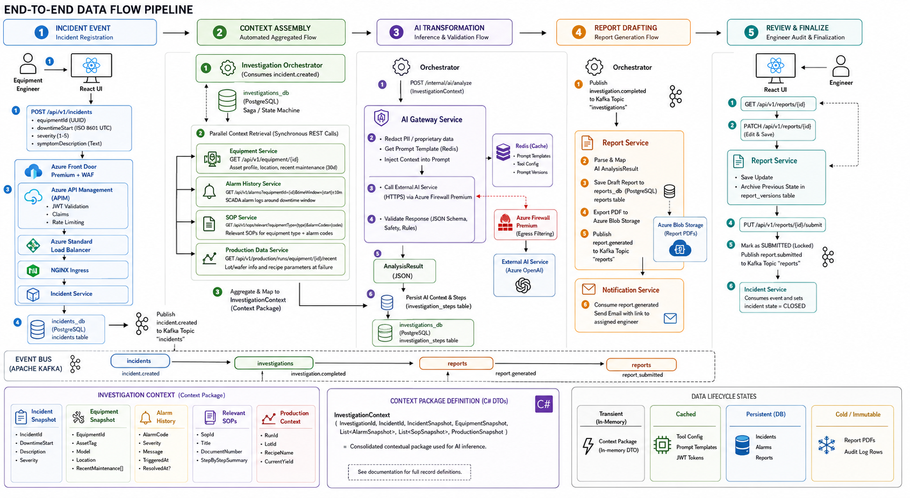
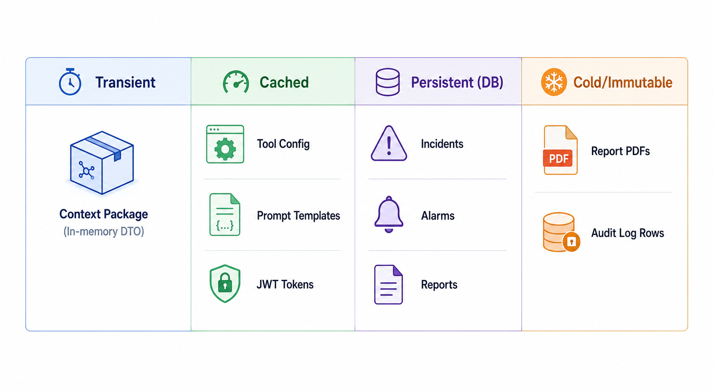

# 04 — Data Flow

## 1. End-to-End Data Flow Pipeline

This document charts how data moves through the platform during an incident investigation lifecycle. The lifecycle is divided into five distinct data flow stages:



---

### Stage 1: Incident Registration (Command Flow)
1.  An **Equipment Engineer** submits a downtime report via the React UI.
2.  The React client sends a `POST /api/v1/incidents` payload containing:
    *   `equipmentId` (UUID)
    *   `downtimeStart` (ISO 8601 UTC timestamp)
    *   `severity` (1-5 classification)
    *   `symptomDescription` (Text)
3.  The request hits **Azure Front Door Premium + WAF**, which filters the traffic and routes it to **Azure API Management (APIM)**. APIM validates the JWT access token/claims, checks rate limits, and forwards the request through the **Azure Standard Load Balancer** and **NGINX Ingress** to the **Incident Service**.
4.  The **Incident Service** validates the payload, writes a record to `incidents_db` in the `incidents` table, and publishes an `incident.created` event to the `incidents` Kafka topic.

### Stage 2: Automated Context Assembly (Aggregated Flow)
1.  The **Investigation Orchestrator** consumes the `incident.created` event and spawns a new Saga state machine instance in `investigations_db`.
2.  The orchestrator reads the incident data and executes parallel synchronous REST calls to gather context:
    *   **Equipment Service**: `GET /api/v1/equipment/{id}` (Retrieves asset profile, location, and maintenance records within the last 30 days).
    *   **Alarm History Service**: `GET /api/v1/alarms?equipmentId={id}&timeWindow={start}±10m` (Retrieves SCADA alarm logs triggered close to the downtime window).
    *   **SOP Service**: `GET /api/v1/sops/relevant?equipmentType={type}&alarmCodes={codes}` (Queries the SOP database for standard procedures matching the active alarms).
    *   **Production Data Service**: `GET /api/v1/production/runs/equipment/{id}/recent` (Retrieves lot/wafer info and recipe parameter names active at failure).
3.  The orchestrator acts as a **data aggregator**, mapping these payloads into a consolidated **Context Package** (`InvestigationContext` object).

### Stage 3: AI Inference & Validation Flow
1.  The Orchestrator invokes the **AI Gateway Service** via `POST /internal/ai/analyze`, passing the Context Package.
2.  The **AI Gateway**:
    *   Redacts PII or proprietary parameters (e.g., specific operator names) based on rules.
    *   Injects the context into a pre-configured, versioned **Prompt Template** retrieved from Redis.
    *   Executes an outbound HTTPS REST call to the **External AI Service** (e.g., Azure OpenAI) routed through the **Azure Firewall Premium** for secure egress filtering.
3.  Upon receiving the raw AI completion, the AI Gateway runs validation logic (JSON schema checks, safety evaluations).
4.  If the response is valid, the AI Gateway returns a standardized JSON structure (`AnalysisResult`) to the orchestrator. If it fails validation, the gateway throws an error, prompting the orchestrator to trigger its retry strategy.
5.  The orchestrator writes the finalized AI context package to `investigation_steps` for auditing.

### Stage 4: Report Generation Flow
1.  The Orchestrator publishes an `investigation.completed` event to Kafka.
2.  The **Report Service** consumes this event. It parses the validated AI `AnalysisResult` and maps the recommended steps, alarm logs, and identified root causes into a structured draft report database entry.
3.  The service saves the draft report to `reports_db` and exports a reference PDF to **Azure Blob Storage**.
4.  The Report Service publishes a `report.generated` event.
5.  The **Notification Service** consumes the event and sends an email containing a link to the draft report to the assigned engineer.

### Stage 5: Engineer Audit & Finalization Flow
1.  The engineer logs in to the React UI, navigates to the report, and retrieves it via `GET /api/v1/reports/{id}`.
2.  The engineer edits fields (e.g., refining the root cause description or adjusting corrective actions) and saves changes via `PATCH /api/v1/reports/{id}`.
3.  The **Report Service** writes the update, archiving the previous state in the `report_versions` table for historical audit tracking.
4.  When satisfied, the engineer clicks "Submit" (`PUT /api/v1/reports/{id}/submit`).
5.  The Report Service marks the report status as `SUBMITTED`, locks it against further edits, and publishes a `report.submitted` event to Kafka.
6.  The **Incident Service** consumes the event and transitions the incident state to `CLOSED`.

---

## 2. Context Package Definition (C# Data Contracts)

To demonstrate how the Orchestrator aggregates data, here is the C# DTO representation of the Context Package sent to the AI Layer:

```csharp
namespace Platform.Shared.Contracts.DTOs;

/// <summary>
/// The consolidated contextual package used for AI inference.
/// </summary>
public record InvestigationContext(
    Guid InvestigationId,
    Guid IncidentId,
    IncidentSnapshot Incident,
    EquipmentSnapshot Equipment,
    List<AlarmSnapshot> AlarmHistory,
    List<SopSnapshot> RelevantSops,
    ProductionSnapshot ProductionContext
);

public record IncidentSnapshot(
    Guid IncidentId,
    DateTime DowntimeStart,
    string Description,
    int Severity
);

public record EquipmentSnapshot(
    Guid EquipmentId,
    string AssetTag,
    string Model,
    string Manufacturer,
    string Location,
    List<MaintenanceRecordDto> RecentMaintenance
);

public record MaintenanceRecordDto(
    Guid RecordId,
    string Description,
    DateTime PerformedAt,
    string PartsReplaced,
    double DowntimeHours
);

public record AlarmSnapshot(
    string AlarmCode,
    string Severity,
    string Message,
    DateTime TriggeredAt,
    DateTime? ResolvedAt
);

public record SopSnapshot(
    string SopId,
    string Title,
    string DocumentNumber,
    string StepByStepSummary
);

public record ProductionSnapshot(
    string RunId,
    string LotId,
    string RecipeName,
    double CurrentYield
);
```

---

## 3. Data Lifecycle States


---

*Next: [05 — Integration Strategy →](../05-integration-strategy/README.md)*
