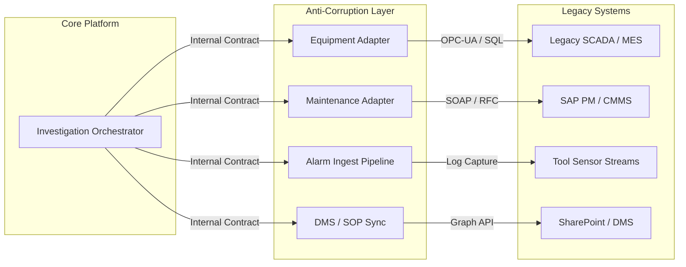

# 05 — Integration Strategy

## 1. System Integration Overview

Integrating with existing factory databases, enterprise maintenance systems, and telemetry pipes requires a robust strategy. Legacy industrial environments are often unstable or use proprietary protocols. This platform isolates its core business logic from these external systems using the **Anti-Corruption Layer (ACL)** and **Adapter** patterns.



---

## 2. Integration Adapters Specification

### 2.1 Equipment Integration Adapter
*   **Target System**: Factory SCADA & MES databases.
*   **Legacy Protocol**: OPC-UA / Direct ODBC database links.
*   **Adapter Pattern Implementation**:
    *   Exposes a clean REST API interface to the internal network (`/api/v1/equipment`).
    *   Translates legacy SQL schemas into the platform's domain model (`EquipmentSnapshot`).
    *   Implements a write-around Redis cache to store asset configurations (24-hour TTL) to protect legacy databases from redundant reads.

### 2.2 Maintenance Integration Adapter (CMMS)
*   **Target System**: SAP PM / IBM Maximo.
*   **Legacy Protocol**: SOAP Web Services / REST with XML payloads.
*   **Adapter Pattern Implementation**:
    *   Encapsulates connection details, WS-Security headers, and XML parsing.
    *   Maps legacy maintenance codes (e.g., "MNT-034-PM") to platform-readable maintenance categories.
    *   Translates XML responses to JSON DTOs.

### 2.3 Alarm Event Ingestion Adapter
*   **Target System**: Industrial Alarm Management System.
*   **Legacy Protocol**: Text-based event logs / Syslog / AMQP.
*   **Adapter Pattern Implementation**:
    *   A lightweight daemon (built in .NET Core) runs near the alarm host.
    *   It parses new log lines using Regex and streams them as clean, structured JSON messages directly to the `alarm-raw` Kafka topic.
    *   The **Alarm History Service** consumes from this raw topic, runs rate-limiting filters (deduplication of chattering alarms), and writes them to TimescaleDB.

### 2.4 Document Management System (SOP) Adapter
*   **Target System**: SharePoint Online / Documentum.
*   **Legacy Protocol**: Microsoft Graph API.
*   **Adapter Pattern Implementation**:
    *   Runs as a cron job inside Kubernetes every hour.
    *   Uses a delta query to pull newly uploaded or updated SOP PDF files.
    *   Extracts metadata (alarm codes, equipment type, tags) and full-text content.
    *   Pushes updates to the **SOP Service** database and indexes the raw text to **Elasticsearch**.

---

## 3. Resilience & Failure Handling Strategy

The integration layer assumes external services are untrusted and prone to latency spikes and outages. We enforce four layers of resilience:

1.  **Strict HTTP Timeouts**: Max 5-second timeout for context-gathering calls. If a legacy system hangs, we do not block the investigation pipeline.
2.  **Circuit Breaker (Polly)**: If an adapter fails 5 consecutive times in 30 seconds, the circuit opens. Downstream calls fail-fast, preventing thread exhaustion.
3.  **Default/Cached Fallbacks**:
    *   *Equipment Service*: If the database is offline, serve from Redis cache.
    *   *Maintenance Service*: If CMMS is offline, return an empty array and flag the context as `INCOMPLETE_MAINTENANCE`. The investigation proceeds.
4.  **Graceful Degradation**: The Investigation Orchestrator evaluates the quality of gathered data. A missing SOP or maintenance record does not abort the workflow; the context package is built with warning flags, alerting the engineer and the AI of the missing parameters.

---

## 4. Illustrative C# Code: Integration Adapter Contract

Here is the contract definition for the Maintenance Integration Adapter, demonstrating how legacy properties are abstracted:

```csharp
namespace Platform.Shared.Contracts.Integration;

using Platform.Shared.Contracts.DTOs;

/// <summary>
/// Interface for the Anti-Corruption Layer (ACL) adapter communicating with legacy CMMS.
/// </summary>
public interface ICmmsIntegrationAdapter
{
    /// <summary>
    /// Gathers maintenance records for an asset, translating legacy SOAP/XML to a clean internal contract.
    /// </summary>
    /// <param name="assetTag">The corporate asset tag (e.g. ASSET-LITH-042)</param>
    /// <param name="sinceDate">Start date window</param>
    /// <param name="ct">Cancellation token for enforcing timeouts</param>
    Task<IEnumerable<MaintenanceRecordDto>> GetRecentMaintenanceAsync(
        string assetTag, 
        DateTime sinceDate, 
        CancellationToken ct
    );
    
    /// <summary>
    /// Checks the network health of the legacy endpoint.
    /// </summary>
    Task<AdapterHealthStatus> GetAdapterHealthAsync();
}

public record AdapterHealthStatus(
    bool IsHealthy,
    string TargetEndpoint,
    string LatencyMs,
    string ErrorMessage = ""
);
```

---

*Next: [06 — Database Design →](../06-database-design/README.md)*
