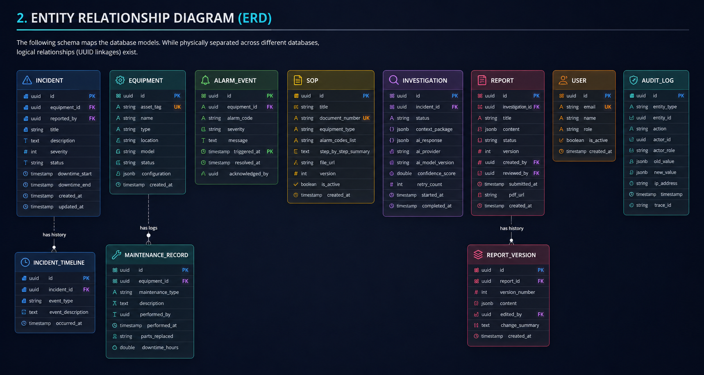

# 06 — Database Design

## 1. Database-per-Service Architecture

The platform enforces a strict **Database-per-Service** design. Microservices do not share database servers, schemas, or tables. 

Cross-service data correlation is performed at the service tier by querying APIs or consuming asynchronous events published to Apache Kafka. This ensures operational isolation, independent scaling, and zero coupling between schema versions.

---

## 2. Entity Relationship Diagram (ERD)

The following schema maps the database models. While physically separated across different databases, logical relationships (UUID linkages) exist.

```mermaid
erDiagram
    %% Incident DB
    INCIDENT {
        uuid id PK
        uuid equipment_id FK
        uuid reported_by FK
        string title
        text description
        int severity
        string status
        timestamp downtime_start
        timestamp downtime_end
        timestamp created_at
        timestamp updated_at
    }
    
    INCIDENT_TIMELINE {
        uuid id PK
        uuid incident_id FK
        string event_type
        text event_description
        timestamp occurred_at
    }

    INCIDENT ||--o{ INCIDENT_TIMELINE : "has history"

    %% Equipment DB
    EQUIPMENT {
        uuid id PK
        string asset_tag UK
        string name
        string type
        string location
        string model
        string status
        jsonb configuration
        timestamp created_at
    }
    
    MAINTENANCE_RECORD {
        uuid id PK
        uuid equipment_id FK
        string maintenance_type
        text description
        uuid performed_by
        timestamp performed_at
        string parts_replaced
        double downtime_hours
    }

    EQUIPMENT ||--o{ MAINTENANCE_RECORD : "has logs"

    %% Alarm DB (TimescaleDB)
    ALARM_EVENT {
        uuid id PK
        uuid equipment_id FK
        string alarm_code
        string severity
        text message
        timestamp triggered_at PK
        timestamp resolved_at
        uuid acknowledged_by
    }

    %% SOP DB
    SOP {
        uuid id PK
        string title
        string document_number UK
        string equipment_type
        string alarm_codes_list
        text step_by_step_summary
        string file_url
        int version
        boolean is_active
        timestamp created_at
    }

    %% Investigation DB
    INVESTIGATION {
        uuid id PK
        uuid incident_id FK
        string status
        jsonb context_package
        jsonb ai_response
        string ai_provider
        string ai_model_version
        double confidence_score
        int retry_count
        timestamp started_at
        timestamp completed_at
    }

    %% Report DB
    REPORT {
        uuid id PK
        uuid investigation_id FK
        string title
        jsonb content
        string status
        int version
        uuid created_by FK
        uuid reviewed_by FK
        timestamp submitted_at
        string pdf_url
        timestamp created_at
    }

    REPORT_VERSION {
        uuid id PK
        uuid report_id FK
        int version_number
        jsonb content
        uuid edited_by FK
        text change_summary
        timestamp created_at
    }

    REPORT ||--o{ REPORT_VERSION : "has history"

    %% Users DB
    USER {
        uuid id PK
        string email UK
        string name
        string role
        boolean is_active
        timestamp created_at
    }
    
    %% Audit DB (Append-Only)
    AUDIT_LOG {
        uuid id PK
        string entity_type
        uuid entity_id
        string action
        uuid actor_id
        string actor_role
        jsonb old_value
        jsonb new_value
        string ip_address
        timestamp timestamp
        string trace_id
    }
```



> [!TIP]
> **Visual Reference**: If the diagram above does not render in your markdown viewer, you can view the exported image file directly:
> 

---

## 3. Core Database Schemas (SQL DDL)

Here are the DDL schemas for the database services, showing keys, indexes, and JSONB mapping:

### 3.1 Incident Service Database (`incidents_db`)
```sql
CREATE TABLE incidents (
    id UUID PRIMARY KEY DEFAULT gen_random_uuid(),
    equipment_id UUID NOT NULL,
    reported_by UUID NOT NULL,
    title VARCHAR(255) NOT NULL,
    description TEXT NOT NULL,
    severity INT NOT NULL CHECK (severity BETWEEN 1 AND 5),
    status VARCHAR(50) NOT NULL DEFAULT 'REPORTED',
    downtime_start TIMESTAMP WITH TIME ZONE NOT NULL,
    downtime_end TIMESTAMP WITH TIME ZONE,
    created_at TIMESTAMP WITH TIME ZONE NOT NULL DEFAULT CURRENT_TIMESTAMP,
    updated_at TIMESTAMP WITH TIME ZONE NOT NULL DEFAULT CURRENT_TIMESTAMP
);

CREATE TABLE incident_timeline_entries (
    id UUID PRIMARY KEY DEFAULT gen_random_uuid(),
    incident_id UUID NOT NULL REFERENCES incidents(id) ON DELETE CASCADE,
    event_type VARCHAR(100) NOT NULL,
    event_description TEXT NOT NULL,
    occurred_at TIMESTAMP WITH TIME ZONE NOT NULL DEFAULT CURRENT_TIMESTAMP
);

-- Indexing for speed on lookups and lists
CREATE INDEX idx_incidents_equipment ON incidents(equipment_id);
CREATE INDEX idx_incidents_status ON incidents(status);
CREATE INDEX idx_incident_timeline_ref ON incident_timeline_entries(incident_id);
```

### 3.2 Equipment Service Database (`equipment_db`)
```sql
CREATE TABLE equipment (
    id UUID PRIMARY KEY DEFAULT gen_random_uuid(),
    asset_tag VARCHAR(100) UNIQUE NOT NULL,
    name VARCHAR(255) NOT NULL,
    type VARCHAR(100) NOT NULL,
    location VARCHAR(100) NOT NULL,
    model VARCHAR(100) NOT NULL,
    status VARCHAR(50) NOT NULL DEFAULT 'RUN',
    configuration JSONB, -- Flexible JSON for custom parameters per chamber
    created_at TIMESTAMP WITH TIME ZONE NOT NULL DEFAULT CURRENT_TIMESTAMP
);

CREATE TABLE maintenance_records (
    id UUID PRIMARY KEY DEFAULT gen_random_uuid(),
    equipment_id UUID NOT NULL REFERENCES equipment(id),
    maintenance_type VARCHAR(100) NOT NULL,
    description TEXT NOT NULL,
    performed_by UUID NOT NULL,
    performed_at TIMESTAMP WITH TIME ZONE NOT NULL,
    parts_replaced VARCHAR(255),
    downtime_hours DOUBLE PRECISION NOT NULL DEFAULT 0.0
);

CREATE INDEX idx_maintenance_eq_date ON maintenance_records(equipment_id, performed_at DESC);
```

### 3.3 Alarm History Database (`alarms_db` - TimescaleDB)
```sql
CREATE TABLE alarm_events (
    id UUID NOT NULL,
    equipment_id UUID NOT NULL,
    alarm_code VARCHAR(50) NOT NULL,
    severity VARCHAR(50) NOT NULL,
    message TEXT NOT NULL,
    triggered_at TIMESTAMP WITH TIME ZONE NOT NULL,
    resolved_at TIMESTAMP WITH TIME ZONE,
    acknowledged_by UUID
);

-- Convert to hypertable partitioned by triggered_at in 7-day intervals
SELECT create_hypertable('alarm_events', 'triggered_at', chunk_time_interval => INTERVAL '7 days');

-- Create time-series index for fast lookup within time windows
CREATE INDEX idx_alarms_eq_trigger ON alarm_events(equipment_id, triggered_at DESC);
```

### 3.4 SOP Database (`sops_db`)
```sql
CREATE TABLE sops (
    id UUID PRIMARY KEY DEFAULT gen_random_uuid(),
    title VARCHAR(255) NOT NULL,
    document_number VARCHAR(100) UNIQUE NOT NULL,
    equipment_type VARCHAR(100) NOT NULL,
    alarm_codes VARCHAR(50)[] NOT NULL, -- Array of matching alarm codes
    step_by_step_summary TEXT NOT NULL,
    file_url VARCHAR(512) NOT NULL,
    version INT NOT NULL DEFAULT 1,
    is_active BOOLEAN NOT NULL DEFAULT TRUE,
    created_at TIMESTAMP WITH TIME ZONE NOT NULL DEFAULT CURRENT_TIMESTAMP
);

-- GIN Index for array overlap search (e.g. finding SOP matching alarm list)
CREATE INDEX idx_sops_alarm_codes ON sops USING GIN (alarm_codes);
```

### 3.5 Investigation Database (`investigations_db`)
```sql
CREATE TABLE investigations (
    id UUID PRIMARY KEY DEFAULT gen_random_uuid(),
    incident_id UUID NOT NULL,
    status VARCHAR(50) NOT NULL,
    context_package JSONB,       -- Schema-less package sent to AI (compressed / structured)
    ai_response JSONB,           -- Unstructured AI response parsed internally
    ai_provider VARCHAR(100),
    ai_model_version VARCHAR(100),
    confidence_score DOUBLE PRECISION,
    retry_count INT NOT NULL DEFAULT 0,
    started_at TIMESTAMP WITH TIME ZONE NOT NULL DEFAULT CURRENT_TIMESTAMP,
    completed_at TIMESTAMP WITH TIME ZONE
);

CREATE INDEX idx_investigations_incident ON investigations(incident_id);
```

### 3.6 Report Database (`reports_db`)
```sql
CREATE TABLE reports (
    id UUID PRIMARY KEY DEFAULT gen_random_uuid(),
    investigation_id UUID NOT NULL,
    title VARCHAR(255) NOT NULL,
    content JSONB NOT NULL,       -- Contains structured findings: root cause, actions, etc.
    status VARCHAR(50) NOT NULL DEFAULT 'DRAFT',
    version INT NOT NULL DEFAULT 1,
    created_by UUID NOT NULL,
    reviewed_by UUID,
    submitted_at TIMESTAMP WITH TIME ZONE,
    pdf_url VARCHAR(512),
    created_at TIMESTAMP WITH TIME ZONE NOT NULL DEFAULT CURRENT_TIMESTAMP
);

CREATE TABLE report_versions (
    id UUID PRIMARY KEY DEFAULT gen_random_uuid(),
    report_id UUID NOT NULL REFERENCES reports(id) ON DELETE CASCADE,
    version_number INT NOT NULL,
    content JSONB NOT NULL,
    edited_by UUID NOT NULL,
    change_summary TEXT,
    created_at TIMESTAMP WITH TIME ZONE NOT NULL DEFAULT CURRENT_TIMESTAMP
);

CREATE INDEX idx_report_versions_lookup ON report_versions(report_id, version_number DESC);
```

---

## 4. Key Design Decisions

| Decision | Rationale |
|----------|-----------|
| **JSONB for `context_package` & `content`** | AI outputs and investigation parameters shift frequently. Storing them as native binary JSON avoids migration locks on big database engines. |
| **Separating Reports from Incidents** | Separating reporting concerns from incident lifecycle keeps service responsibilities focused. An incident could fail its investigation phase, requiring multiple report drafting cycles without polluting the incident database. |
| **TimescaleDB for Alarms** | Industrial tools generate millions of events. Standard databases experience table locks at scale. TimescaleDB partitions data into discrete physical tables (chunks) automatically, improving write speed. |

---

*Next: [07 — Deployment Architecture →](../07-deployment-architecture/README.md)*
