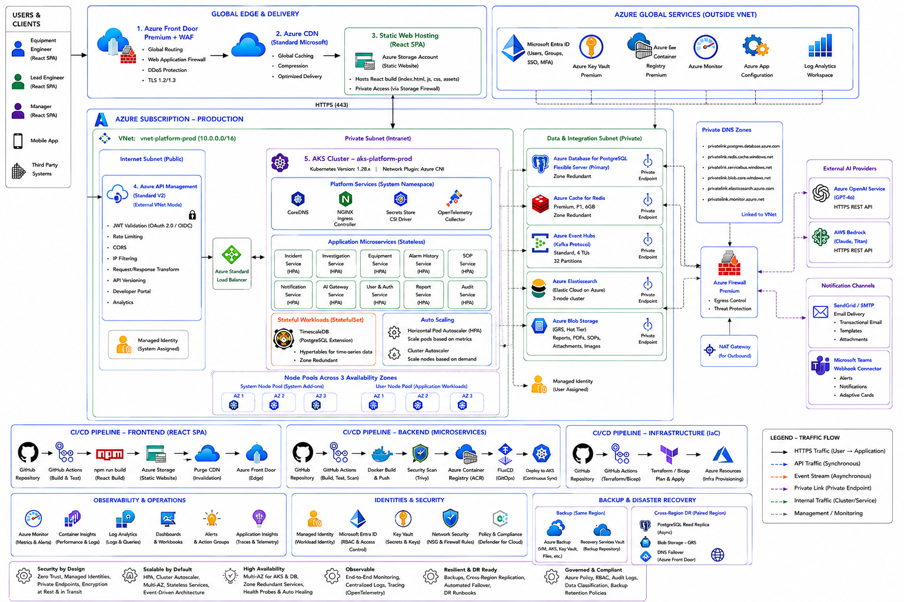
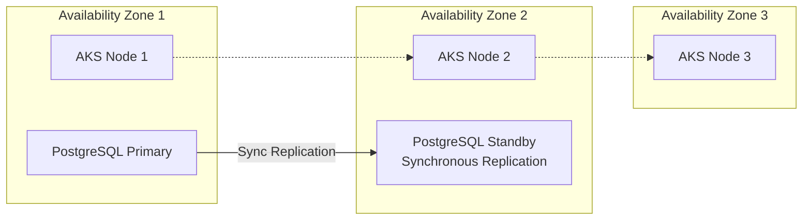

# 07 — Deployment Architecture

## 1. Kubernetes & Azure Infrastructure Design

The platform is designed to deploy natively to **Azure Kubernetes Service (AKS)**, leveraging Azure-managed PaaS resources for data storage, messaging, caching, and identity to reduce operational overhead while maintaining enterprise-grade security and high availability.

### 1.1 Complete Infrastructure Topology

The diagram below shows **every** Azure resource, network boundary, AKS pod, database instance, and external integration used by the platform:

```mermaid
graph TB
    %% ── Users & Clients ──
    ENG["🧑‍🔧 Equipment Engineer<br/>React SPA"]
    LEAD["🧑‍💼 Lead Engineer<br/>React SPA"]
    MGR["📊 Manager<br/>React SPA"]
    MOBILE["📱 Mobile App"]
    THIRD_PARTY["🌐 Third-Party Systems"]

    %% ── Global Edge & Delivery ──
    subgraph edge_delivery ["Global Edge & Delivery"]
        FD["1. Azure Front Door Premium + WAF<br/>Global Routing, DDoS Protection, WAF"]
        CDN["2. Azure CDN (Standard Microsoft)<br/>Global Caching, Compression"]
        STATIC_WEB["3. Static Web Hosting (React SPA)<br/>Azure Storage Account<br/>Static Website Hosting"]
    end

    ENG --> FD
    LEAD --> FD
    MGR --> FD
    MOBILE --> FD
    THIRD_PARTY --> FD

    FD --> CDN
    CDN --> STATIC_WEB

    subgraph azure_sub ["Azure Subscription: semicon-prod"]

        %% ── Azure Global Services (Outside VNet) ──
        ENTRA["🔐 Microsoft Entra ID<br/>Users, Groups, SSO, MFA"]
        KV["🔑 Azure Key Vault Premium<br/>HSM Secrets, Keys, Certificates"]
        ACR["📦 Azure Container Registry Premium<br/>Geo-replicated Images, Scanning"]
        MONITOR["📊 Azure Monitor & Log Analytics<br/>Container Insights, Workspace"]
        APPCONFIG["⚙️ Azure App Configuration<br/>Feature Flags, Dynamic Config"]

        subgraph vnet ["VNet: vnet-platform-prod (10.0.0.0/16)"]

            %% ── Public Subnet ──
            subgraph subnet_apim ["Internet Subnet: snet-apim (Public)"]
                APIM["4. Azure API Management (Standard V2)<br/>External VNet Mode<br/>JWT, Rate Limiting, CORS, API Versioning"]
                LB["Azure Standard Load Balancer"]
                APIM --> LB
            end

            %% ── Private Subnet (AKS) ──
            subgraph subnet_aks ["Private Subnet: snet-aks (Intranet)"]
                subgraph aks_cluster ["5. AKS Cluster: aks-platform-prod (K8s 1.28.x)"]
                    subgraph ns_system ["Platform Services (System Namespace)"]
                        COREDNS["CoreDNS"]
                        INGRESS["NGINX Ingress Controller"]
                        CSI["Secrets Store CSI Driver"]
                        OTEL_COLL["OpenTelemetry Collector"]
                    end

                    subgraph ns_prod ["Application Microservices (Stateless)"]
                        POD_INC["📋 Incident Service (HPA)"]
                        POD_ORCH["🎯 Investigation Service (HPA)"]
                        POD_RPT["📊 Report Service (HPA)"]
                        POD_EQUIP["🔧 Equipment Service (HPA)"]
                        POD_ALARM["🚨 Alarm History Service (HPA)"]
                        POD_SOP["📄 SOP Service (HPA)"]
                        POD_PROD["🏭 Production Data Service (HPA)"]
                        POD_AI["🤖 AI Gateway Service (HPA)"]
                        POD_AUTH["🔐 User & Auth Service (HPA)"]
                        POD_NOTIF["📧 Notification Service (HPA)"]
                        POD_AUDIT["📝 Audit Service (HPA)"]
                    end

                    subgraph stateful_workloads ["Stateful Workloads (StatefulSet)"]
                        TIMESCALE["⏱️ TimescaleDB (alarms_db)<br/>PostgreSQL Extension<br/>Zone Redundant, 100GB PVC"]
                    end
                end
            end

            %% ── Private Subnet (Data) ──
            subgraph subnet_data ["Data & Integration Subnet (Private)"]
                subgraph pg_cluster ["Azure Database for PostgreSQL Flexible Server"]
                    DB_INC["incidents_db (PE)"]
                    DB_EQUIP["equipment_db (PE)"]
                    DB_SOP["sops_db (PE)"]
                    DB_PROD["production_db (PE)"]
                    DB_INV["investigations_db (PE)"]
                    DB_RPT["reports_db (PE)"]
                    DB_USER["users_db (PE)"]
                    DB_AUDIT["audit_db (PE)"]
                end
                REDIS["Azure Cache for Redis Premium<br/>6GB, Zone-Redundant (PE)"]
                EH["Azure Event Hubs (Kafka Protocol)<br/>Standard, 4 TUs, 32 Partitions (PE)"]
                ES["Elasticsearch (Elastic Cloud)<br/>2-node cluster (PE)"]
                BLOB["Azure Blob Storage (GRS)<br/>Report PDFs, SOP Files, Images (PE)"]
            end

            %% ── Outbound Routing ──
            NAT["NAT Gateway<br/>(for Outbound)"]
            FIREWALL["🛡️ Azure Firewall Premium<br/>Egress Control, Threat Protection"]

            subnet_aks --> NAT
            NAT --> FIREWALL
        end

        %% ── Private DNS Zones ──
        subgraph dns_zones ["Private DNS Zones"]
            DNS_PG["privatelink.postgres.database.azure.com"]
            DNS_REDIS["privatelink.redis.cache.windows.net"]
            DNS_EH["privatelink.servicebus.windows.net"]
            DNS_BLOB["privatelink.blob.core.windows.net"]
            DNS_ES["privatelink.elasticsearch.azure.com"]
            DNS_MON["privatelink.monitor.azure.com"]
        end
    end

    %% ── External AI & Notifications ──
    AI_PRIMARY["🧠 Azure OpenAI Service<br/>GPT-4o<br/>HTTPS REST API"]
    AI_FALLBACK["🧠 AWS Bedrock (Fallback)<br/>Claude, Titan<br/>HTTPS REST API"]
    SMTP["📧 SendGrid / SMTP<br/>Email Delivery"]
    TEAMS["💬 Microsoft Teams<br/>Webhook Connector"]

    %% ── Traffic Flow Inbound ──
    FD -->|HTTPS 443| APIM
    LB --> INGRESS
    INGRESS --> POD_INC
    INGRESS --> POD_ORCH
    INGRESS --> POD_RPT
    INGRESS --> POD_EQUIP
    INGRESS --> POD_ALARM
    INGRESS --> POD_SOP
    INGRESS --> POD_PROD
    INGRESS --> POD_AI
    INGRESS --> POD_AUTH

    %% ── Workload Private Connections ──
    POD_INC -.-> DB_INC
    POD_EQUIP -.-> DB_EQUIP
    POD_ALARM -.-> TIMESCALE
    POD_SOP -.-> DB_SOP
    POD_SOP -.-> ES
    POD_PROD -.-> DB_PROD
    POD_ORCH -.-> DB_INV
    POD_RPT -.-> DB_RPT
    POD_RPT -.-> BLOB
    POD_AUTH -.-> DB_USER
    POD_AUDIT -.-> DB_AUDIT

    POD_EQUIP -.-> REDIS
    POD_AI -.-> REDIS

    %% ── Event Streams ──
    POD_INC --> EH
    POD_ORCH --> EH
    POD_RPT --> EH
    POD_NOTIF --> EH
    POD_AUDIT --> EH

    %% ── Egress via Firewall ──
    FIREWALL --> AI_PRIMARY
    FIREWALL --> AI_FALLBACK
    FIREWALL --> SMTP
    FIREWALL --> TEAMS

    %% ── Security & Identity Integrations ──
    CSI -.-> KV
    APPCONFIG -.-> POD_AI

    %% ── Monitoring ──
    OTEL_COLL --> MONITOR

    %% ── CI/CD Pipelines ──
    subgraph pipeline_fe ["CI/CD Pipeline - Frontend (React SPA)"]
        GH_FE["GitHub Repository"] --> GHA_FE["GitHub Actions (Build & Test)"] --> npm_build["npm run build (React Build)"] --> storage_fe["Azure Storage (Static Website)"] --> purge_cdn["Purge CDN (Invalidation)"] --> fd_edge["Azure Front Door (Edge)"]
    end

    subgraph pipeline_be ["CI/CD Pipeline - Backend (Microservices)"]
        GH_BE["GitHub Repository"] --> GHA_BE["GitHub Actions (Build, Test, Scan)"] --> docker_build["Docker Build & Push"] --> scan_trivy["Security Scan (Trivy)"] --> acr_be["Azure Container Registry (ACR)"] --> FluxCD["FluxCD (GitOps)"] --> deploy_aks["Deploy to AKS (Continuous Sync)"]
    end

    subgraph pipeline_infra ["CI/CD Pipeline - Infrastructure (IaC)"]
        GH_IA["GitHub Repository"] --> GHA_IA["GitHub Actions (Terraform/Bicep)"] --> tf_apply["Terraform / Bicep Plan & Apply"] --> provision_azure["Azure Resources (Infra Provisioning)"]
    end

    docker_build --> ACR
    tf_apply --> azure_sub
```



> [!TIP]
> **Visual Reference**: If the diagram above does not render in your markdown viewer, you can view the exported image file directly:
> 

---

### 1.2 Network Architecture Detail

The entire platform operates inside a single Azure Virtual Network (**VNet**) with strict subnet isolation enforced by Network Security Groups (NSGs).

| Subnet | CIDR | Purpose | NSG Rules |
|--------|------|---------|-----------|
| `snet-apim` | `10.0.1.0/24` | Azure API Management gateway endpoint | Allow inbound HTTPS (443) from Internet. Deny all other inbound. |
| `snet-aks` | `10.0.4.0/22` | AKS node pool VM scale sets (512 IP addresses) | Allow inbound from `snet-apim` only. Allow outbound to `snet-data`. Deny direct internet inbound. |
| `snet-data` | `10.0.8.0/24` | PostgreSQL, Redis, Event Hubs, Blob Storage Private Endpoints | **Deny ALL inbound from internet**. Allow inbound only from `snet-aks`. |

**Key Security Boundaries:**
*   **No public IP** is assigned to any database, cache, or message broker. All data-tier resources are accessed exclusively via **Azure Private Endpoints** within the VNet.
*   **Azure API Management** is the sole public-facing entry point for the entire platform.
*   AKS pods access **Azure Key Vault** secrets via the **Secrets Store CSI Driver**, which mounts secrets as in-memory tmpfs volumes at container startup — no secrets are stored in environment variables or Kubernetes ConfigMaps.

---

### 1.3 AKS Cluster Configuration

```
Cluster Name:       aks-platform-prod
Kubernetes Version: 1.30.x (LTS)
Network Plugin:     Azure CNI Overlay
Network Policy:     Calico
DNS Prefix:         platform-prod
Uptime SLA:         Enabled (99.95% control plane)
Workload Identity:  Enabled (Azure AD federation)
```

#### Node Pools

| Pool Name | Mode | VM SKU | vCPU | RAM | Min Nodes | Max Nodes | AZ Spread | Purpose |
|-----------|------|--------|------|-----|-----------|-----------|-----------|---------|
| `system` | System | `Standard_D2s_v5` | 2 | 8 GB | 2 | 3 | Zones 1,2,3 | CoreDNS, Ingress Controller, OTel Collector, CSI Driver |
| `workload` | User | `Standard_D4s_v5` | 4 | 16 GB | 3 | 8 | Zones 1,2,3 | All 11 platform microservice pods |

#### Pod Resource Allocations

| Service | Replicas | CPU Request | CPU Limit | Memory Request | Memory Limit | HPA Target |
|---------|----------|-------------|-----------|----------------|--------------|------------|
| Incident Service | 2 | 250m | 500m | 256Mi | 512Mi | 70% CPU |
| Equipment Service | 2 | 250m | 500m | 256Mi | 512Mi | 70% CPU |
| Alarm History Service | 2 | 500m | 1000m | 512Mi | 1Gi | 70% CPU |
| SOP Service | 2 | 250m | 500m | 256Mi | 512Mi | 70% CPU |
| Production Data Service | 2 | 250m | 500m | 256Mi | 512Mi | 70% CPU |
| Investigation Orchestrator | 2 | 500m | 1000m | 512Mi | 1Gi | 70% CPU |
| AI Gateway Service | 2 | 500m | 1000m | 512Mi | 1Gi | 60% CPU |
| Report Service | 2 | 250m | 500m | 256Mi | 512Mi | 70% CPU |
| User & Auth Service | 2 | 250m | 500m | 256Mi | 512Mi | 70% CPU |
| Notification Service | 1 | 100m | 250m | 128Mi | 256Mi | — |
| Audit Service | 2 | 250m | 500m | 256Mi | 512Mi | 70% CPU |
| **Total (Min)** | **21** | **3,850m** | | **4,352Mi** | | |

---

### 1.4 Data Tier Specifications

| Resource | Azure Service | SKU | HA Configuration | Backup Policy | Private Endpoint |
|----------|--------------|-----|-------------------|---------------|-----------------|
| **PostgreSQL** (8 databases) | Azure Database for PostgreSQL Flexible Server | General Purpose, 4 vCPU, 32 GB Storage | Zone-Redundant HA (synchronous standby) | Daily automated backup, 35-day retention | ✅ `snet-data` |
| **TimescaleDB** (alarms) | Containerized on AKS (StatefulSet) | Dedicated node, 100 GB PVC | PVC replication via Azure Disk snapshots | Hourly pg_dump to Blob Storage | Internal K8s Service |
| **Redis** | Azure Cache for Redis | Premium P1, 6 GB | Zone-Redundant, AOF persistence | Azure-managed snapshots | ✅ `snet-data` |
| **Kafka** | Azure Event Hubs (Kafka surface) | Standard, 4 Throughput Units | Zone-Redundant (built-in) | 7-day event retention | ✅ `snet-data` |
| **Elasticsearch** | Elastic Cloud on Azure | 2-node cluster, 8 GB RAM each | Cross-zone deployment | Daily snapshots to Azure Blob | ✅ `snet-data` |
| **Blob Storage** | Azure Storage Account | General Purpose v2, GRS | Geo-Redundant (automatic) | Soft delete 30 days, versioning enabled | ✅ `snet-data` |

#### Kafka Topic Design

| Topic Name | Partitions | Retention | Consumers |
|------------|-----------|-----------|-----------|
| `incidents` | 8 | 7 days | Investigation Orchestrator, Audit Service |
| `investigations` | 8 | 7 days | Report Service, Notification Service, Audit Service |
| `reports` | 4 | 7 days | Incident Service, Notification Service, Audit Service |
| `ai-events` | 4 | 7 days | Audit Service |
| `*.dlq` (Dead Letter) | 2 each | 30 days | Manual replay by operators |

---

## 2. GitHub Actions CI/CD Pipeline

The deployment pipeline is fully automated via **GitHub Actions**, establishing a secure, auditable delivery path from developer commit to Kubernetes production namespace.

### 2.1 Pipeline Architecture Diagram

```mermaid
graph LR
    subgraph developer ["Developer Workstation"]
        DEV["👨‍💻 Developer<br/>Feature Branch"]
    end

    subgraph github ["GitHub"]
        PR["Pull Request<br/>Code Review"]
        MAIN["main branch<br/>Protected"]
    end

    subgraph ci_pipeline ["CI Pipeline (GitHub Actions)"]
        RESTORE["📦 dotnet restore<br/>NuGet Packages"]
        BUILD["🔨 dotnet build<br/>All 11 Services"]
        UNIT["🧪 dotnet test<br/>Unit Tests + Coverage"]
        SONAR["🔍 SonarQube<br/>Code Quality Gate"]
        TRIVY["🛡️ Trivy Scan<br/>Docker Image CVEs"]
        SNYK["🛡️ Snyk Scan<br/>NuGet Dependencies"]
    end

    subgraph cd_pipeline ["CD Pipeline (GitHub Actions)"]
        DOCKER["🐳 Docker Build<br/>Multi-stage Build<br/>Tag: git SHA"]
        ACR_PUSH["📦 Push to ACR<br/>Azure Container Registry"]
        HELM_STG["🚀 Helm Deploy<br/>Staging Namespace"]
        INT_TEST["🧪 Integration Tests<br/>Against Staging"]
        GATE["🚦 Manual Approval<br/>Lead Engineer Gate"]
        HELM_PROD["🚀 Helm Deploy<br/>Production Namespace<br/>Blue-Green Strategy"]
        SMOKE["✅ Smoke Tests<br/>Health Check Endpoints"]
    end

    DEV -->|git push| PR
    PR -->|Approved + Merged| MAIN
    MAIN --> RESTORE --> BUILD --> UNIT
    UNIT --> SONAR
    UNIT --> TRIVY
    UNIT --> SNYK
    SONAR -->|Pass| DOCKER
    TRIVY -->|Pass| DOCKER
    SNYK -->|Pass| DOCKER
    DOCKER --> ACR_PUSH --> HELM_STG --> INT_TEST --> GATE --> HELM_PROD --> SMOKE
```



> [!TIP]
> **Visual Reference**: If the diagram above does not render in your markdown viewer, you can view the exported image file directly:
> 

### 2.2 Pipeline Stage Details

#### Stage 1: Continuous Integration (CI) — Triggered on Pull Request

| Step | Tool | Purpose | Failure Action |
|------|------|---------|---------------|
| **Restore** | `dotnet restore` | Download NuGet dependencies | Block PR merge |
| **Build** | `dotnet build --configuration Release` | Compile all 11 microservice projects | Block PR merge |
| **Unit Test** | `dotnet test --collect:"XPlat Code Coverage"` | Run unit tests, enforce ≥80% code coverage | Block PR merge |
| **Code Quality** | SonarQube Scanner | Static analysis: bugs, code smells, security hotspots | Block PR merge if Quality Gate fails |
| **Image Scan** | Trivy (`trivy image`) | Scan Docker base image (`mcr.microsoft.com/dotnet/aspnet:10.0-alpine`) for HIGH/CRITICAL CVEs | Block PR merge |
| **Dependency Scan** | Snyk (`snyk test`) | Scan NuGet packages for known vulnerabilities | Block PR merge |

#### Stage 2: Continuous Delivery (CD) — Triggered on merge to `main`

| Step | Tool | Purpose | Failure Action |
|------|------|---------|---------------|
| **Docker Build** | `docker build --target final` | Multi-stage build: SDK → Runtime. Tag with `git rev-parse --short HEAD` | Pipeline fails |
| **ACR Push** | `az acr login` + `docker push` | Push tagged image to Azure Container Registry | Pipeline fails |
| **Staging Deploy** | `helm upgrade --install --namespace staging` | Deploy all services to staging K8s namespace | Pipeline fails |
| **Integration Tests** | Custom HTTP test suite | Validate API contracts against live staging endpoints | Pipeline fails |
| **Manual Gate** | GitHub Environment Protection Rule | Lead Engineer or Manager must click "Approve" in GitHub UI | Pipeline paused indefinitely |
| **Production Deploy** | `helm upgrade --install --namespace production` | Blue-Green deployment with readiness probes | Pipeline fails, auto-rollback |
| **Smoke Test** | `curl` health endpoints | Verify `/health` returns 200 OK on all 11 services | Trigger automatic rollback |

### 2.3 GitHub Actions Workflow Definition (Illustrative)

```yaml
# .github/workflows/ci-cd-pipeline.yml
name: Platform CI/CD Pipeline

on:
  push:
    branches: [main]
  pull_request:
    branches: [main]

env:
  ACR_NAME: acrplatformprod
  AKS_CLUSTER: aks-platform-prod
  AKS_RG: rg-platform-prod
  HELM_CHART_PATH: ./deploy/helm/platform

jobs:
  # ─── CI: Build, Test, Scan ───
  ci:
    runs-on: ubuntu-latest
    steps:
      - uses: actions/checkout@v4

      - name: Setup .NET 10
        uses: actions/setup-dotnet@v4
        with:
          dotnet-version: '10.0.x'

      - name: Restore Dependencies
        run: dotnet restore Platform.sln

      - name: Build Solution
        run: dotnet build Platform.sln --configuration Release --no-restore

      - name: Run Unit Tests with Coverage
        run: |
          dotnet test Platform.sln \
            --configuration Release \
            --no-build \
            --collect:"XPlat Code Coverage" \
            --results-directory ./TestResults

      - name: SonarQube Quality Gate
        uses: SonarSource/sonarcloud-github-action@v2
        env:
          SONAR_TOKEN: ${{ secrets.SONAR_TOKEN }}

      - name: Trivy Image Scan
        uses: aquasecurity/trivy-action@master
        with:
          image-ref: mcr.microsoft.com/dotnet/aspnet:10.0-alpine
          severity: HIGH,CRITICAL
          exit-code: 1

      - name: Snyk Dependency Scan
        uses: snyk/actions/dotnet@master
        env:
          SNYK_TOKEN: ${{ secrets.SNYK_TOKEN }}

  # ─── CD: Build Image, Push ACR, Deploy ───
  cd-staging:
    needs: ci
    if: github.ref == 'refs/heads/main'
    runs-on: ubuntu-latest
    steps:
      - uses: actions/checkout@v4

      - name: Login to ACR
        uses: azure/docker-login@v1
        with:
          login-server: ${{ env.ACR_NAME }}.azurecr.io
          username: ${{ secrets.ACR_USERNAME }}
          password: ${{ secrets.ACR_PASSWORD }}

      - name: Build & Push Docker Images
        run: |
          SHORT_SHA=$(git rev-parse --short HEAD)
          for svc in incident-service equipment-service alarm-history-service \
                     sop-service production-data-service investigation-orchestrator \
                     ai-gateway-service report-service user-auth-service \
                     notification-service audit-service; do
            docker build -t ${{ env.ACR_NAME }}.azurecr.io/${svc}:${SHORT_SHA} \
                         -f src/${svc}/Dockerfile .
            docker push ${{ env.ACR_NAME }}.azurecr.io/${svc}:${SHORT_SHA}
          done

      - name: Deploy to Staging (Helm)
        uses: azure/k8s-deploy@v4
        with:
          namespace: staging
          manifests: ${{ env.HELM_CHART_PATH }}
          images: ${{ env.ACR_NAME }}.azurecr.io/*:${{ github.sha }}

      - name: Run Integration Tests
        run: dotnet test tests/Integration/ --configuration Release

  cd-production:
    needs: cd-staging
    runs-on: ubuntu-latest
    environment:
      name: production     # ← Requires manual approval in GitHub
    steps:
      - uses: actions/checkout@v4

      - name: Deploy to Production (Blue-Green via Helm)
        run: |
          SHORT_SHA=$(git rev-parse --short HEAD)
          helm upgrade --install platform-prod ${{ env.HELM_CHART_PATH }} \
            --namespace production \
            --set global.image.tag=${SHORT_SHA} \
            --set global.strategy.type=BlueGreen \
            --wait --timeout 300s

      - name: Smoke Test All Services
        run: |
          for svc in incident equipment alarm-history sop production-data \
                     investigation ai-gateway report user-auth \
                     notification audit; do
            STATUS=$(curl -s -o /dev/null -w "%{http_code}" \
              https://api.semicon-corp.com/internal/${svc}/health)
            if [ "$STATUS" -ne 200 ]; then
              echo "FAILED: ${svc} returned ${STATUS}"
              exit 1
            fi
          done
          echo "All services healthy."
```

---

## 3. High Availability (HA) & Disaster Recovery (DR)

The platform is architected for **99.9% uptime**, critical for semiconductor fabrication lines operating 24/7.

### 3.1 High Availability Strategy



> [!TIP]
> **Visual Reference**: If the diagram above does not render in your markdown viewer, you can view the exported image file directly:
> 

*   **Zone Redundancy**: AKS cluster nodes, Event Hubs namespaces, and Redis Premium cache instances are distributed across **three distinct Azure Availability Zones** (AZs).
*   **Pod Anti-Affinity**: Kubernetes scheduling rules ensure that replicas of the same service (e.g., two Incident Service pods) are placed on nodes in *different* availability zones. If Zone 1 goes down, the replica in Zone 2 continues serving traffic without interruption.
*   **Database HA**: Azure Database for PostgreSQL is provisioned in the **zone-redundant High Availability** configuration, maintaining a hot standby instance in an adjacent zone with synchronous replication. Failover is automatic and resolves in under 60 seconds.

### 3.2 Disaster Recovery Strategy (Active-Passive)

```
┌──────────────────────────────┐         ┌──────────────────────────────┐
│   PRIMARY REGION             │         │   SECONDARY REGION           │
│   Southeast Asia             │         │   East Asia                  │
│                              │         │                              │
│   AKS Cluster (Active)      │  ──────►│   AKS Cluster (Standby)     │
│   PostgreSQL Primary         │  Async  │   PostgreSQL Read Replica   │
│   Event Hubs (Active)        │  Repli- │   Event Hubs (Geo-DR Pair)  │
│   Blob Storage (GRS Primary) │  cation │   Blob Storage (GRS Sec.)   │
│   Redis (Active)             │         │   Redis (Passive)           │
└──────────────────────────────┘         └──────────────────────────────┘

         RPO: < 5 minutes  │  RTO: < 1 hour
```

*   **Region Pairing**: Primary region is deployed in **Southeast Asia**; backup region in **East Asia**.
*   **Geo-Replication**:
    *   *PostgreSQL*: Async read replicas are maintained in the secondary region.
    *   *Event Hubs*: Geo-Disaster Recovery pairing provides automatic namespace failover.
    *   *Blob Storage*: Geo-Redundant Storage (GRS) automatically replicates PDF reports and documents.
*   **Target Metrics**:
    *   **RPO (Recovery Point Objective)**: < 5 minutes (Maximum allowable data loss during a regional disaster).
    *   **RTO (Recovery Time Objective)**: < 1 hour (Maximum time to restore full service in the secondary region).

---

## 4. Azure Monthly Cost Analysis

Below is the monthly cost projection for the infrastructure hosting a single High-Availability production cluster and a single non-HA staging environment.

| Azure Resource | SKU / Spec | Qty | Prod Cost (HA) | Staging Cost | Description |
|---|---|---|---|---|---|
| **AKS Cluster** | Uptime SLA Enabled | 1 | $75.00 | $0.00 | AKS Cluster management SLA |
| **AKS System Nodes** | `Standard_D2s_v5` | 2 | $140.00 | $70.00 | Hosts Core DNS, Ingress |
| **AKS Workload Nodes** | `Standard_D4s_v5` | 4 | $560.00 | $140.00 | Core microservice runtimes |
| **PostgreSQL Flexible** | GP 4 vCPU (Zone HA) | 1 | $400.00 | $100.00 | Core databases (HA in Prod) |
| **Event Hubs (Kafka)** | Standard Namespace (4 TUs) | 1 | $300.00 | $40.00 | Message broker |
| **Cache for Redis** | Premium P1 (6GB, HA) | 1 | $300.00 | $50.00 | Cache, sessions, locks |
| **API Management** | Developer / Standard Tier | 1 | $680.00 | $50.00 | APIM gateway proxy |
| **Blob Storage** | GRS / LRS (100GB) | 1 | $15.00 | $5.00 | Report and SOP documents |
| **Elasticsearch** | Elastic Cloud (2 nodes) | 1 | $200.00 | $100.00 | SOP search backend |
| **Key Vault** | Secrets & HSM Keys | 1 | $10.00 | $5.00 | Secrets management |
| **Azure CDN** | Standard Microsoft | 1 | $30.00 | $0.00 | React SPA delivery |
| **Azure Monitor** | Container Insights + Log Analytics | 1 | $50.00 | $20.00 | Logging and metrics |
| **App Configuration** | Standard | 1 | $35.00 | $0.00 | Feature flags, AI provider toggle |
| **Total / Month** | | | **$2,795.00** | **$580.00** | Total hosting cost |

### Total Operational Hosting Cost (Prod + Staging): **$3,375.00 / month**

### Cost Optimization Opportunities:
1.  **Azure Reserved Instances (RI)**: Purchasing 3-year compute reservations for AKS nodes reduces node costs by **35%**.
2.  **AKS Spot Instances**: Workloads in staging can run on Spot node pools, reducing compute cost by **60-80%** (with the trade-off of node evictions).
3.  **Database Consolidation**: In staging, we can run all microservice databases on a single PostgreSQL instance under distinct schemas rather than paying for separate database engines, reducing database costs by **60%**.
4.  **Autoscaling**: HPA ensures workload nodes scale down during low-traffic periods (nights, weekends), saving up to **30%** on average compute.

---

*Next: [09 — Non-Functional Architecture →](../09-non-functional-architecture/README.md)*
