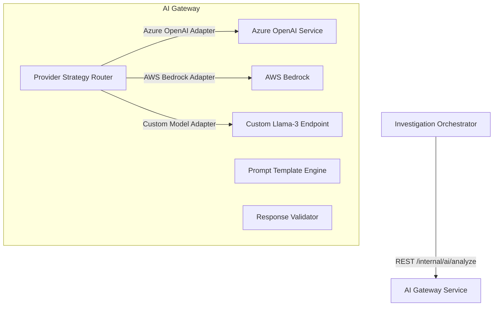
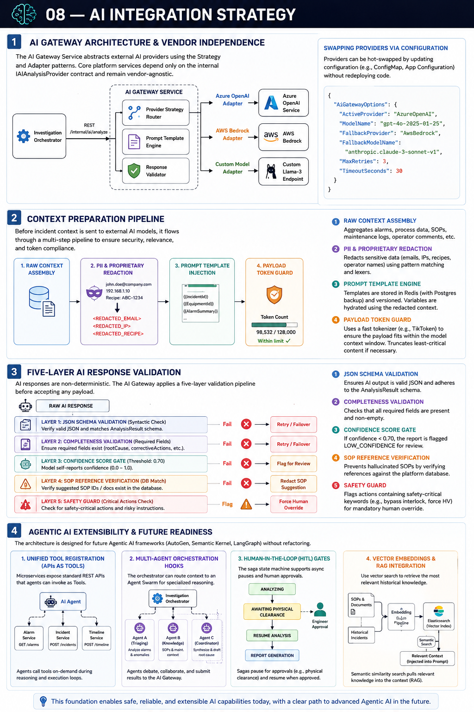

# 08 — AI Integration Strategy

## 1. AI Gateway Architecture & Vendor Independence

To protect core services from external vendor APIs and avoid vendor lock-in, the platform introduces the **AI Gateway Service**. This service acts as an abstraction boundary, implementing the **Strategy** and **Adapter** patterns.

The core platform interacts only with the internal `IAIAnalysisProvider` contract. Backend logic remains completely unaware of whether the underlying AI model is hosted on Azure OpenAI, AWS Bedrock, or a local server.



> [!TIP]
> **Visual Reference**: If the diagram above does not render in your markdown viewer, you can view the exported image file directly:
> 

### Swapping Providers via Configuration
Providers can be hot-swapped dynamically by updating service configurations (e.g., in Kubernetes config maps or Azure App Configuration) without redeploying code.

```json
{
  "AiGatewayOptions": {
    "ActiveProvider": "AzureOpenAI",
    "ModelName": "gpt-4o-2025-01-25",
    "FallbackProvider": "AwsBedrock",
    "FallbackModelName": "anthropic.claude-3-sonnet-v1",
    "MaxRetries": 3,
    "TimeoutSeconds": 30
  }
}
```

---

## 2. Context Preparation Pipeline

Before incident context is dispatched to external AI models, it undergoes a multi-step **Context Preparation Pipeline**:

```
[Raw Context Assembly] ──► [PII & Proprietary Redaction] ──► [Prompt Injection] ──► [Payload Token Guard]
```

1.  **PII & Proprietary Redaction**: Equipment configurations and operator comments may contain sensitive proprietary data or operator names. The pipeline sweeps the JSON payload, matching patterns (Regex, Lexers) to redact operators' emails, IP addresses, and specific sensor recipes, replacing them with generic tags (e.g., `<REDACTED_IP>`).
2.  **Prompt Template Engine**: Prompt templates are stored in Redis (with PostgreSQL backup) and versioned. The engine hydrates the template variables using the redacted context package.
3.  **Token Guard**: AI APIs have context limits. The Token Guard runs a fast tokenizer (e.g., TikToken) on the formatted payload. If the token count exceeds the model limit (e.g., 128k tokens), it truncates the oldest alarm logs or maintenance records first, ensuring the critical downtime symptoms and relevant SOP summaries are preserved.

---

## 3. Five-Layer AI Response Validation

AI models are non-deterministic and can produce invalid JSON or "hallucinate" incorrect SOP references. The AI Gateway applies a **Five-Layer Validation Pipeline** before accepting any payload:

```
[Raw AI Response]
       │
       ├──► Layer 1: JSON Schema Validation (Syntactic Check) ──[Fail]──► Retry / Failover
       │
       ├──► Layer 2: Completeness Validation (Required Fields) ──[Fail]──► Retry / Failover
       │
       ├──► Layer 3: Confidence Score Gate (Threshold: 0.70) ──[Fail]──► Flag for Review
       │
       ├──► Layer 4: SOP Reference Verification (DB Match) ────[Fail]──► Redact SOP suggestion
       │
       └──► Layer 5: Safety Guard (Critical Actions Check) ───[Flag]──► Force Human Override
```

1.  **JSON Schema Validation**: Verifies that the AI response is valid JSON and matches the structured schemas (`AnalysisResult`).
2.  **Completeness Validation**: Checks for required fields, ensuring the model provided at least one `rootCause` and a `correctiveAction` list.
3.  **Confidence Score Gate**: The prompt instructs the model to return a self-assessed confidence score (0.0 to 1.0) based on context clarity. If the score falls below `0.70`, the report is generated but flagged with a `LOW_CONFIDENCE` warning.
4.  **SOP Reference Verification**: Checks suggested SOP IDs or Document Numbers against the database index. If the AI suggests an SOP document that does not exist in the platform, it is immediately stripped to prevent engineers from following phantom procedures.
5.  **Safety Guard**: If the AI suggests actions containing safety-critical keywords (e.g., "bypass interlock," "force high voltage"), the gateway flags the report as `SAFETY_REVIEW_REQUIRED`, forcing a Lead Engineer to sign off before the report can be finalized.

---

## 4. Agentic AI Extensibility & Future Readiness

While the current requirement focuses on automated report generation, this architecture is designed to support future **Agentic AI** frameworks (such as AutoGen, Semantic Kernel, or LangGraph) without requiring database or service refactoring:

### 1. Unified Tool Registration (APIs as Tools)
Microservices are built with standard REST contracts. In an agentic setup, the AI Agent can act as a controller, using these APIs as **Tools**. For example, the agent can query the Alarm Service (`GET /api/v1/alarms`) or update the incident timeline (`POST /api/v1/incidents/{id}/timeline`) on-demand as it executes its reasoning loop.

### 2. Multi-Agent Orchestration Hooks
The **Investigation Orchestrator** is ready to host multi-agent workflows:
*   Instead of calling a single prompt, the orchestrator can route the context package to an **Agent Swarm**.
*   *Agent A (Triaging Agent)*: Examines alarms and flags anomalies.
*   *Agent B (Knowledge Agent)*: Evaluates SOP logs and historical maintenance runs.
*   *Agent C (Coordinator Agent)*: Debates the inputs, drafts the root cause, and submits it to the AI Gateway.

### 3. Human-in-the-Loop (HITL) Gates
The Saga State Machine supports asynchronous workflow pauses. In a future agentic loop, the agent might decide: *"I need to run a sensor diagnostic test, but this requires physical clearance."* The orchestrator can pause the saga, transition state to `AWAITING_PHYSICAL_CLEARANCE`, notify the engineer, and resume the saga once the engineer approves the command.

### 4. Vector Embeddings & RAG Integration
The **SOP Service** is index-linked to Elasticsearch. In future iterations, we can generate vector embeddings of all SOPs and historical incident reports, storing them in Elasticsearch (which natively supports Vector Search). The context assembler can run semantic similarity searches to pull the most relevant historical fixes, injecting them directly into the context package (Retrieval-Augmented Generation).

---

*Next: [09 — Non-Functional Architecture](../09-non-functional-architecture/README.md)*
