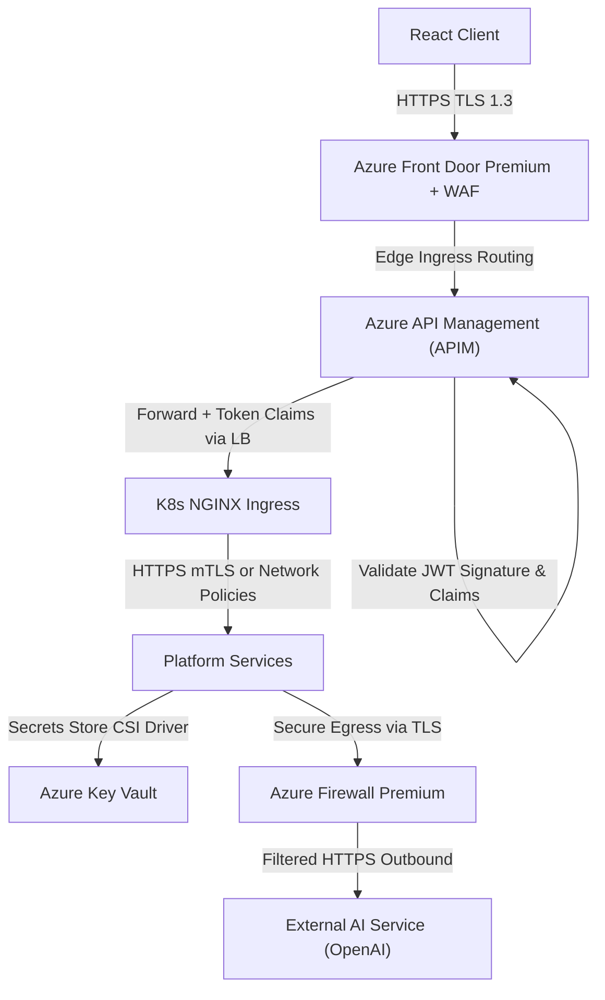
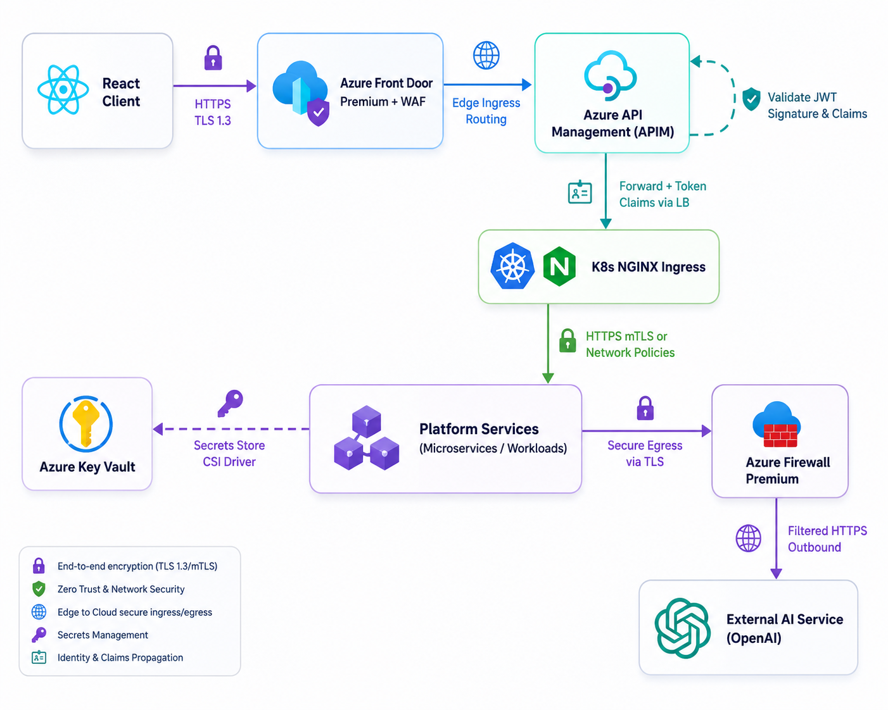
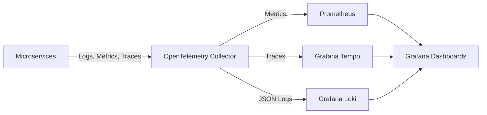
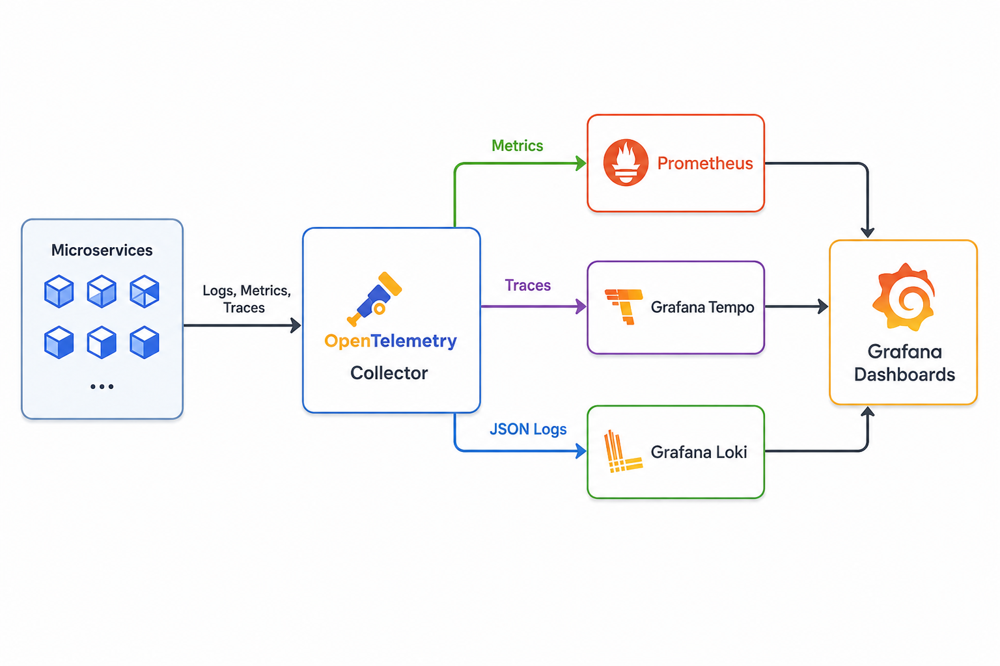

# 09 — Non-Functional Architecture

## 1. Zero-Trust Security Architecture

The platform enforces a **Zero-Trust Security Model** across all workloads and endpoints. No user, service, or connection is trusted by default, regardless of whether they originate inside or outside the Kubernetes network boundaries.



> [!TIP]
> **Visual Reference**: If the diagram above does not render in your markdown viewer, you can view the exported image file directly:
> 

### 1.1 Authentication & Token Validation
*   **Identity Provider**: Federated authentication via **Azure AD** (OIDC protocol).
*   **Edge Validation**: Inbound HTTP requests are filtered by **Azure Front Door Premium + WAF** at the global edge to block malicious payloads (SQLi, XSS, DDoS) before routing to the API gateway.
*   **JWT Access Tokens**: Inbound HTTP requests must contain an `Authorization: Bearer <Token>` header. Tokens have a short lifetime (15 minutes). **APIM** validates signatures against Azure AD's openid-configuration keys.
*   **Workload Identity**: Internal service-to-service communication is secured via **Azure Workload Identity**. Pods assume a managed Azure identity (Service Account mapped to an Entra ID Service Principal) to query resources without using static connection strings or credentials.

### 1.2 Role-Based Access Control (RBAC)
Authorizations are enforced both at the Gateway (routing restrictions) and at the application tier (claims-based verification).

```csharp
// Example Authorization Attribute in ASP.NET Core
[Authorize(Roles = "LeadEngineer,SystemAdmin")]
[HttpPatch("reports/{id}")]
public async Task<IActionResult> EditReport(Guid id, [FromBody] EditReportRequest request)
{
    // Controller logic...
}
```

### 1.3 Encryption & Key Management
*   **In-Transit**: TLS 1.3 is terminated at the edge by **Azure Front Door Premium**. Traffic is re-encrypted and forwarded (TLS 1.2) to **APIM** and down to the **AKS NGINX Ingress Controller**. All service-to-service communication inside the cluster is encrypted via HTTPS (secured with network policies).
*   **At-Rest**: Azure Database for PostgreSQL and Blob Storage volumes are encrypted using AES-256 with customer-managed keys (CMK) stored in **Azure Key Vault**.
*   **Secrets Store CSI Driver**: Environment credentials, database passwords, and API keys are not stored in source code. They are fetched dynamically at container startup from Azure Key Vault and mounted as temporary memory-only files.

---

## 2. Observability Architecture

Observability is instrumented at the runtime tier using **OpenTelemetry (OTel)**, providing a vendor-neutral diagnostics pipeline.



> [!TIP]
> **Visual Reference**: If the diagram above does not render in your markdown viewer, you can view the exported image file directly:
> 

### 2.1 Three-Pillar Monitoring Stack
*   **Distributed Tracing**: Standard OpenTelemetry SDKs trace commands as they flow across boundaries (e.g., from `Incident Service` → `Kafka` → `Orchestrator` → `AI Gateway`). A unified `traceparent` (W3C format) header propagates the context.
*   **Structured Logging**: Services write structured JSON logs directly to `stdout`. Logs contain correlation IDs (`TraceId`, `SpanId`, `UserId`). The logs are collected by **Grafana Loki**.
*   **Prometheus Metrics**: Every service exposes a `/metrics` scrape endpoint. Core SLIs tracked:
    *   *Saga Completion Latency* (p50, p95, p99 percentiles).
    *   *AI Inference Failure Rates* (HTTP error codes).
    *   *Kafka Consumer Lag* (Offset difference to prevent processing delays).
    *   *APIM HTTP Traffic* (Throughput, response codes).

---

## 3. Resilience & Failure Isolation

Resilience is handled within the application layer using **Polly** (via `Microsoft.Extensions.Http.Resilience`), ensuring that downstream degradation does not cascade.

### 3.1 Polly Resilience Pipeline Config (C# Code)

Here is the exact setup for the AI Gateway HTTP Client, combining Circuit Breakers, Retries, and Timeouts:

```csharp
using System;
using System.Net.Http;
using Microsoft.Extensions.DependencyInjection;
using Polly;
using Polly.CircuitBreaker;
using Polly.Retry;
using Polly.Timeout;

namespace Platform.Shared.Infrastructure.Resilience;

public static class ResilienceConfiguration
{
    public static IServiceCollection AddAiGatewayHttpClient(this IServiceCollection services)
    {
        // Define Polly strategies
        var retryStrategy = new RetryStrategyOptions<HttpResponseMessage>
        {
            MaxRetryAttempts = 3,
            BackoffType = DelayBackoffType.Exponential,
            UseJitter = true,
            Delay = TimeSpan.FromSeconds(1),
            ShouldHandle = new PredicateBuilder<HttpResponseMessage>()
                .Handle<HttpRequestException>()
                .HandleResult(r => (int)r.StatusCode >= 500) // Retry only on transient errors
        };

        var circuitBreakerStrategy = new CircuitBreakerStrategyOptions<HttpResponseMessage>
        {
            FailureRatio = 0.5, // Break if 50% of requests fail in the window
            SamplingDuration = TimeSpan.FromSeconds(30),
            MinimumThroughput = 8,
            BreakDuration = TimeSpan.FromSeconds(60),
            ShouldHandle = new PredicateBuilder<HttpResponseMessage>()
                .Handle<HttpRequestException>()
                .HandleResult(r => (int)r.StatusCode >= 500)
        };

        var timeoutStrategy = new TimeoutStrategyOptions
        {
            Timeout = TimeSpan.FromSeconds(15) // Enforce hard timeout for vendor calls
        };

        // Bind strategies to the HTTP Client
        services.AddHttpClient("AiGatewayClient", client =>
        {
            client.BaseAddress = new Uri("https://api.openai.azure.com/");
        })
        .AddResilienceHandler("ai-vendor-pipeline", builder =>
        {
            builder
                .AddTimeout(timeoutStrategy)
                .AddRetry(retryStrategy)
                .AddCircuitBreaker(circuitBreakerStrategy);
        });

        return services;
    }
}
```

### 3.2 Kafka Dead Letter Queue (DLQ)
When a consumer (e.g., the **Report Service**) processes an event but encounters a non-transient database exception (e.g., database constraint breach), it does not crash or block the offset partitions:
1.  The consumer catches the exception and logs the stack trace.
2.  It serializes the failed payload, injecting metadata (original topic, error description, attempt count) into headers.
3.  It publishes the payload to the `report.generated.dlq` topic.
4.  The consumer commits the offset on the primary partition, allowing other messages to process.
5.  An alert notifies engineers. The DLQ message can be replayed manually after schema updates or fixes.

---

## 4. Audit Trail

All write operations, authentication events, and AI requests are captured in an **immutable audit ledger** via the dedicated **Audit Service**.

### Design Principles
*   **Append-Only Storage**: The `audit_db` PostgreSQL database is configured with no `UPDATE` or `DELETE` permissions on the `audit_logs` table. Records are insert-only, creating a tamper-proof ledger.
*   **Event-Driven Capture**: The Audit Service subscribes to **all Kafka topics** (`incidents`, `investigations`, `reports`, `ai-events`). Every domain event is automatically captured without requiring individual services to call audit APIs explicitly.
*   **Structured Audit Record**: Each entry contains:

| Field | Type | Description |
|-------|------|-------------|
| `entity_type` | string | The aggregate being modified (e.g., `Incident`, `Report`) |
| `entity_id` | UUID | The ID of the modified record |
| `action` | string | The operation performed (e.g., `CREATED`, `UPDATED`, `SUBMITTED`) |
| `actor_id` | UUID | The authenticated user who triggered the action |
| `actor_role` | string | The RBAC role at the time of action (e.g., `Engineer`, `LeadEngineer`) |
| `old_value` | JSONB | Snapshot of the record before modification (null for creates) |
| `new_value` | JSONB | Snapshot of the record after modification |
| `ip_address` | string | Source IP address of the request |
| `trace_id` | string | OpenTelemetry trace ID for end-to-end correlation |
| `timestamp` | datetime | UTC timestamp of the action |

*   **AI Decision Auditing**: Every AI inference request is logged with the prompt template version, model name, token count, confidence score, and whether validation passed or failed. This satisfies regulatory requirements for AI explainability in semiconductor manufacturing.
*   **Query Access**: Only users with `SystemAdmin` or `LeadEngineer` roles can query the audit log via `GET /api/v1/audit-logs`. Results support filtering by entity type, actor, date range, and action.

---

## 5. Scalability Architecture

The platform scales independently at multiple layers to handle increasing factory automation loads without requiring architectural changes.

### 5.1 Horizontal Pod Autoscaling (HPA)

Every service deployment (except Notification Service) is configured with Kubernetes HPA, scaling pod replicas based on CPU utilization:

```yaml
# Example: Investigation Orchestrator HPA
apiVersion: autoscaling/v2
kind: HorizontalPodAutoscaler
metadata:
  name: investigation-orchestrator-hpa
  namespace: production
spec:
  scaleTargetRef:
    apiVersion: apps/v1
    kind: Deployment
    name: investigation-orchestrator
  minReplicas: 2
  maxReplicas: 8
  metrics:
    - type: Resource
      resource:
        name: cpu
        target:
          type: Utilization
          averageUtilization: 70
```

### 5.2 Multi-Layer Scaling Strategy

| Layer | Scaling Method | Trigger | Min → Max |
|-------|---------------|---------|-----------|
| **API Gateway** | Azure APIM auto-scale units | Request throughput | 1 → 4 units |
| **AKS Node Pool** | Cluster Autoscaler | Pod scheduling pressure | 3 → 8 nodes |
| **Service Pods** | Horizontal Pod Autoscaler (HPA) | CPU > 70% | 2 → 8 replicas per service |
| **PostgreSQL** | Vertical scaling (vCPU/RAM resize) | Monitoring alerts | 4 → 16 vCPU |
| **Event Hubs (Kafka)** | Throughput Unit auto-inflate | Ingress byte rate | 4 → 20 TUs |
| **Redis** | Shard scaling (Premium cluster) | Memory utilization | 1 → 3 shards |
| **TimescaleDB** | Chunk compression + retention | Data volume | 7-day active, 90-day compressed |

### 5.3 Database Scalability Patterns
*   **Read Replicas**: PostgreSQL supports up to 5 read replicas. High-read services (Equipment, SOP) can route `GET` queries to replicas while writes go to the primary.
*   **TimescaleDB Compression**: Alarm data older than 7 days is automatically compressed using TimescaleDB's native columnar compression, reducing storage by ~90% while remaining queryable.
*   **Caching**: Equipment configurations and prompt templates are cached in Redis with TTLs (24h for equipment, 1h for prompts), reducing database pressure by ~80% for repeated reads.

---

## 6. High Availability & Disaster Recovery

> For detailed deployment topology, see [07 — Deployment Architecture](../07-deployment-architecture/README.md).

### 6.1 High Availability (99.9% Uptime Target)

| Component | HA Strategy | Failover Time |
|-----------|------------|---------------|
| **AKS Nodes** | 3 Availability Zones, pod anti-affinity rules | Immediate (pods rescheduled in seconds) |
| **PostgreSQL** | Zone-redundant HA with synchronous standby | < 60 seconds automatic failover |
| **Redis** | Zone-redundant Premium with AOF persistence | < 30 seconds |
| **Event Hubs** | Zone-redundant (built-in) | Transparent |
| **API Gateway (APIM)** | Multi-zone deployment | Transparent |
| **Blob Storage** | Zone-redundant storage (ZRS) | Transparent |

### 6.2 Disaster Recovery (Cross-Region)

| Metric | Target | Mechanism |
|--------|--------|-----------|
| **RPO** (Recovery Point Objective) | < 5 minutes | Async geo-replication for PostgreSQL, GRS for Blob Storage |
| **RTO** (Recovery Time Objective) | < 1 hour | Standby AKS cluster in paired region, DNS failover via Azure Traffic Manager |

### 6.3 Backup & Retention Policy

| Resource | Backup Frequency | Retention Period |
|----------|-----------------|-----------------|
| PostgreSQL databases | Daily automated + point-in-time | 35 days |
| TimescaleDB (alarms) | Hourly pg_dump to Blob Storage | 90 days |
| Blob Storage (reports/SOPs) | GRS continuous replication | Indefinite |
| Event Hubs events | Built-in retention | 7 days (primary), 30 days (DLQ) |
| Audit logs | Append-only, no deletion | 7 years (regulatory compliance) |

---

*Next: [10 — Sequence Diagrams](../10-sequence-diagrams/README.md) | [11 — Architecture Decision Records](../11-architecture-decision-records/)*

