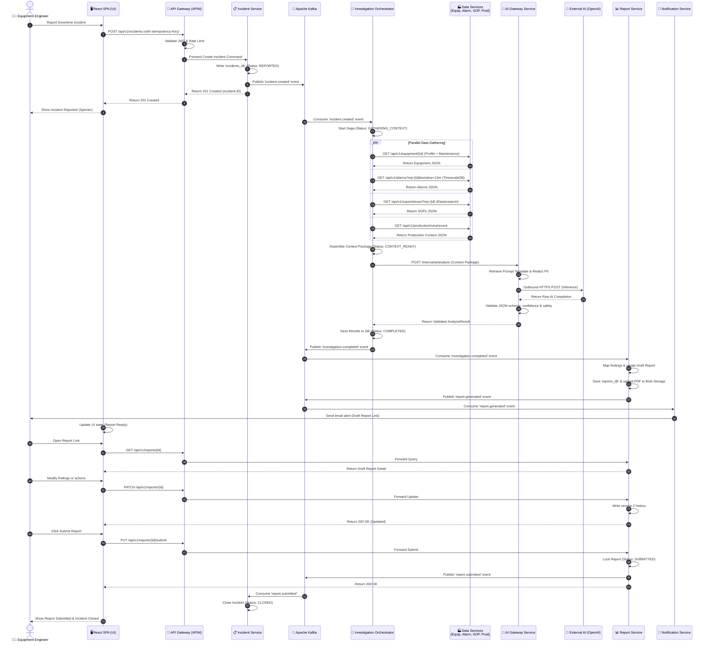
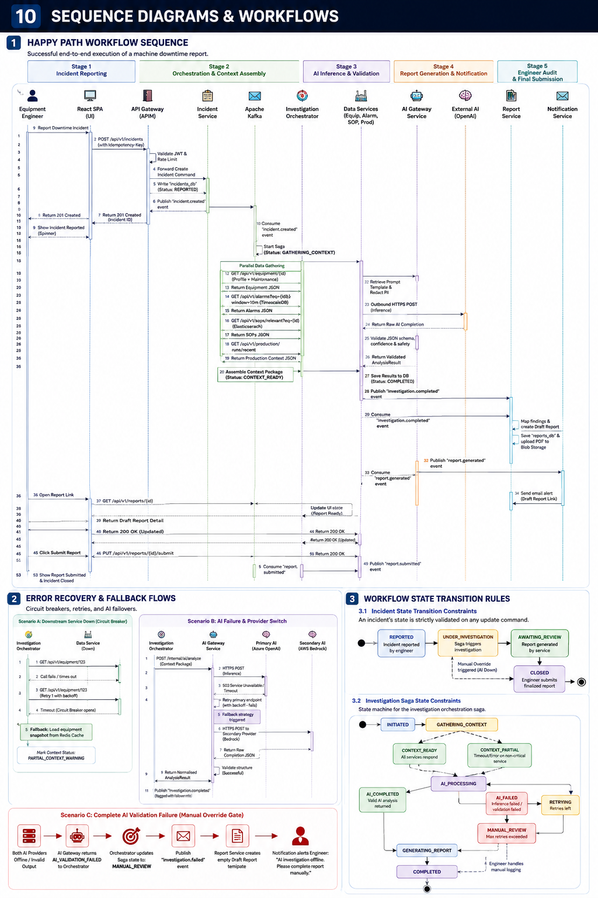
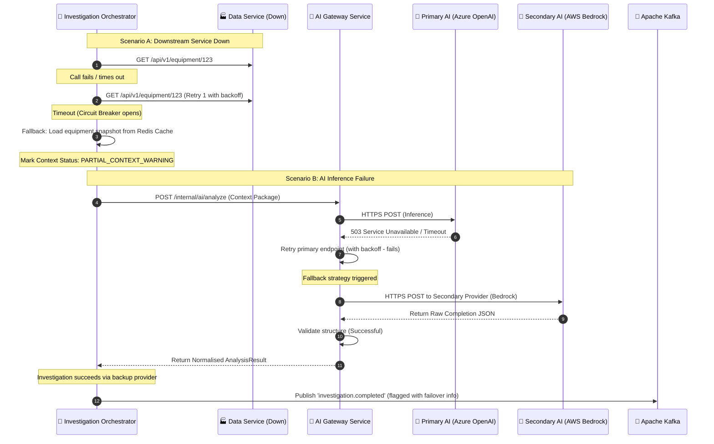
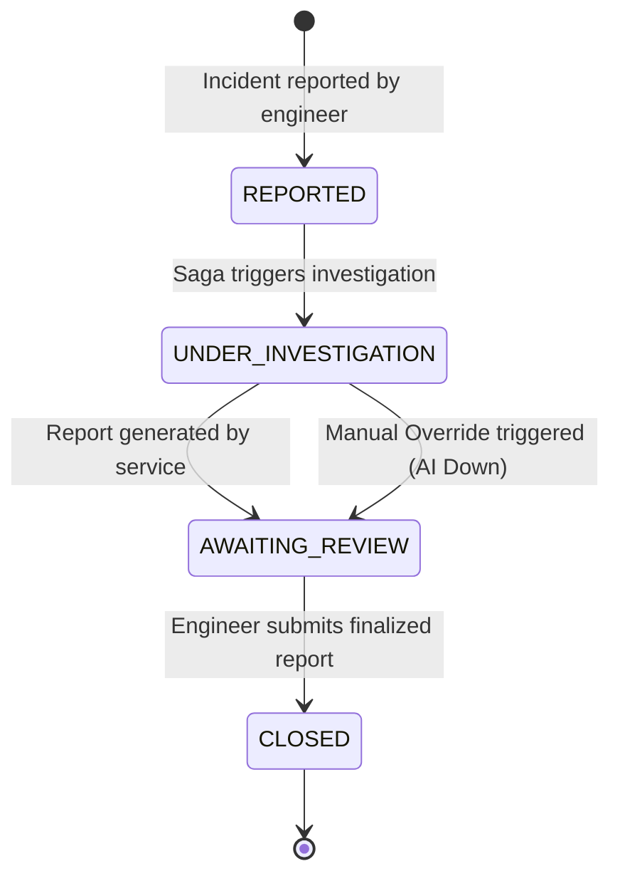
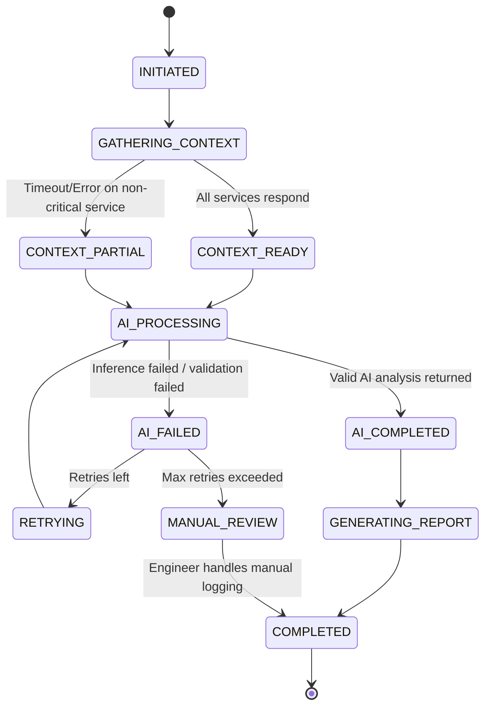

# 10 — Sequence Diagrams & Workflows

## 1. Happy Path Workflow Sequence

The diagram below details the successful end-to-end execution of a machine downtime report, automated data assembly, AI prediction, and final engineer review.



> [!TIP]
> **Visual Reference**: If the diagram above does not render in your markdown viewer, you can view the exported image file directly:
> 

---

## 2. Error Recovery & Fallback Flows

Architecting for failure in manufacturing is mandatory. The sequence below demonstrates how the system degrades gracefully when downstream services or the AI endpoint experience outages.

### Circuit Breakers, Retries, and AI Failovers



### Scenario C: Complete AI Validation Failure (Manual Override Gate)
If both primary and secondary AI services fail to respond, or return data that fails validation checks (e.g., hallucinated SOPs that do not exist), the orchestrator triggers the manual investigation process:

```
[Both AI Providers Offline / Invalid Output]
                      │
                      ▼
[AI Gateway returns AI_VALIDATION_FAILED to Orchestrator]
                      │
                      ▼
[Orchestrator updates Saga state to: MANUAL_REVIEW]
                      │
                      ▼
[Orchestrator publishes 'investigation.failed' event]
                      │
                      ▼
[Report Service creates empty Draft Report template]
                      │
                      ▼
[Notification Service alerts Engineer: "AI investigation offline. Please complete report manually."]
```

---

## 3. Workflow State Transition Rules

### 3.1 Incident State Transition Constraints
An incident's state is strictly validated on any update command. The diagram below represents the allowable state transitions:



### 3.2 Investigation Saga State Constraints



---

*Next: [07 — Deployment Architecture](../07-deployment-architecture/README.md)*
