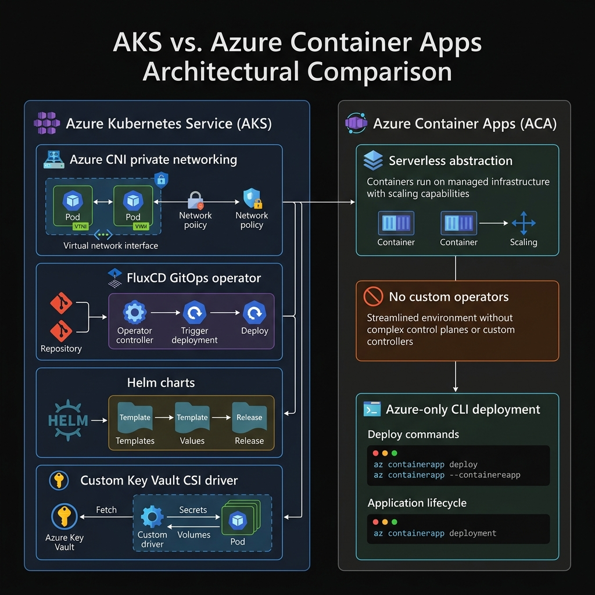

# ADR-007: Container Platform Selection (AKS vs. Azure Container Apps)

## Status
Accepted

## Date
2026-07-18

## Context
The platform comprises 11 decoupled microservices interacting via an event backbone (Apache Kafka) and standard REST endpoints. The system operates in a high-security manufacturing environment (semiconductor fabrication) and must satisfy:
1.  **Strict Zero-Trust Networking**: Micro-segmentation between pods to prevent unauthorized lateral movement.
2.  **GitOps-Driven Continuous Delivery**: Automated synchronization of cluster states with a centralized Git repository (FluxCD).
3.  **Secrets Security**: Dynamic mounting of secrets from Azure Key Vault without storing credentials as plain-text environment variables.
4.  **Hybrid & Multi-Cloud Portability**: The ability to run the exact same platform layout inside a physical manufacturing plant (on-premise bare-metal Kubernetes) or in the public cloud.

We evaluated two primary container hosting options in Microsoft Azure:
1.  **Azure Kubernetes Service (AKS)**: A fully managed, standard Kubernetes offering.
2.  **Azure Container Apps (ACA)**: A serverless container platform built on top of Kubernetes (using KEDA, Dapr, and Envoy) that abstracts underlying cluster management.

---

## Architectural Comparison Diagram

---

## Evaluation Matrix

| Decision Factor | Azure Kubernetes Service (AKS) | Azure Container Apps (ACA) | Impact on Platform |
| :--- | :--- | :--- | :--- |
| **Networking & Zero-Trust** | **Full Control**: Native support for **Azure CNI** (real VNet IPs for pods) and **Kubernetes NetworkPolicies** (Calico). Enables micro-segmentation between services. | **Restricted**: Networking is abstracted. No custom NetworkPolicies can be written to prevent pod-to-pod lateral movement. | **High**: AKS is required to satisfy manufacturing network audit compliance. |
| **GitOps Reconcilers** | **Supported**: Runs standard Kubernetes Operators in-cluster. We can deploy **FluxCD** to pull manifests directly from Git, ensuring automatic drift correction. | **Not Supported**: ACA is serverless and does not allow custom Kubernetes operators or CRDs to run inside the environment. | **High**: AKS enables true GitOps drift detection and automatic reconciliation. |
| **Secrets Security** | **Excellent**: Integrates with **Secrets Store CSI Driver** to mount Key Vault secrets as temporary, in-memory files. Auto-rotates secrets. | **Moderate**: Secrets are injected primarily as environment variables, which can be leaked in process dumps or logs. | **Medium**: AKS ensures credentials never write to disk or persist in memory variables. |
| **Cloud Portability** | **100% Portable**: Uses standard Kubernetes manifests and **Helm charts**. The platform can be deployed on-premise in a fab or on AWS/GCP with no code changes. | **Lock-In**: Uses Azure-proprietary Resource Manager schemas and Dapr configurations. Migrating to another host requires full configuration rewrite. | **Critical**: AKS enables the hybrid deployment model needed for semiconductor fabs. |
| **Management Overhead** | **High**: Requires configuring control plane updates, node scaling rules, and managing ingress controllers. | **Low**: Fully managed serverless platform; scaling, routing, and updates are handled automatically. | **Medium**: AKS has higher operational overhead, but it is mitigated by using Azure-managed upgrades. |

---

## Decision
We select **Azure Kubernetes Service (AKS)** as the platform hosting environment. 

While Azure Container Apps (ACA) reduces management overhead, its serverless abstractions restrict the networking controls, custom operators (FluxCD), and portability needed for this manufacturing architecture. AKS provides the control, security, and industry-standard formatting required for a compliant, multi-cloud, hybrid deployment.

## Consequences
### Benefits:
*   **Zero-Trust Networking**: Enables strict firewall configurations between microservices using NetworkPolicies.
*   **True GitOps**: FluxCD operators can be installed directly in the cluster to reconcile configurations.
*   **No Vendor Lock-In**: Helm charts can run on any CNCF-compliant Kubernetes distribution (AKS, GKE, EKS, or on-premise Rancher/MicroK8s).

### Trade-offs:
*   **Infrastructure Management**: The DevOps team must manage AKS node pools, ingress controllers (NGINX), and certificates (Cert-Manager).
*   **Higher Initial Cost**: Running VM worker scale-sets in AKS carries a higher baseline cost than ACA's pay-per-execution serverless model.
